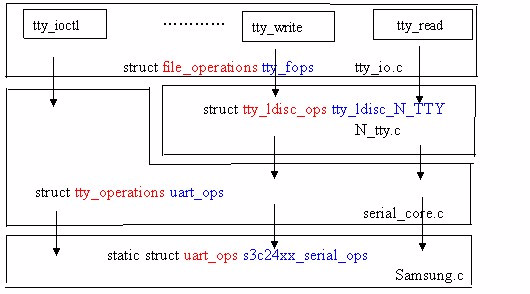

# Linux驱动之串口（UART）

[https://www.cnblogs.com/big-devil/p/8590050.html](https://www.cnblogs.com/big-devil/p/8590050.html)

**<uart驱动程序概述>**

在嵌入式Linux系统中，串口被看成终端设备，终端设备（tty）的驱动程序分为3部分：

tty_core

tty_disicipline

tty_driver

包括3个结构体：uart_driver,uart_port,uart_ops（include/serial_core.h）。因此，实现一个平台的uart驱动程序只要实现这3个结构体即可。

**<uart_driver和tty_driver之间的关系>**


a:uart_driver结构体

uart_driver包含了串口设备名、串口驱动名、主次设备号、串口控制台(可选)等信息，还封装了tty_driver(底层串口驱动无需关心tty_driver)。

```
struct uart_driver
 {

    struct module  *owner; //拥有该uart_driver的模块,一般为THIS_MODULE 
    constchar *driver_name; // 串口驱动名，串口设备文件名以驱动名为基础 
    constchar *dev_name; // 串口设备名 
    int major; //主设备号 
    int minor; //次设备号 
    int nr; // 该uart_driver支持的串口个数(最大) 
    struct console  *cons;// 其对应的console.若该uart_driver支持serial console,否则为NULL 
    .............................
    struct uart_state  *state;
    struct tty_driver  *tty_driver;   //uart_driver封装了tty_driver，使底层uart驱动不用关心ttr_driver。

};
```

(1)一个tty驱动程序必须注册/注销tty_driver。

(2)一个uart驱动则变为注册/注销uart_driver。

```
int uart_register_driver(struct uart_driver *drv);
void uart_unregister_driver(struct uart_driver *drv);
int tty_register_driver(struct tty_driver *drv);
void tty_unregister_driver(struct tty_driver *drv);
```

实际上，uart_register_driver()和uart_unregister_driver()中分别包含了tty_register_driver()和tty_unregister_driver()的操作,**详情如下：**

**<uart_port>**

*a：uart_port用于描述一个UART端口（直接对应于一个串口）的I/O端口或I/O内存地址、FIFO大小、端口类型等信息。*

```
struct uart_port {
spinlock_t lock;/* 串口端口锁 */
unsignedint iobase;/* IO端口基地址 */
unsignedchar __iomem *membase;/* IO内存基地址,经映射(如ioremap)后的IO内存虚拟基地址 */
unsignedint irq;/* 中断号 */
unsignedint uartclk;/* 串口时钟 */
unsignedint fifosize;/* 串口FIFO缓冲大小 */
unsignedchar x_char;/* xon/xoff字符 */
unsignedchar regshift;/* 寄存器位移 */
unsignedchar iotype;/* IO访问方式 */
unsignedchar unused1;

#define UPIO_PORT (0)/* IO端口 */
#define UPIO_HUB6 (1)
#define UPIO_MEM (2)/* IO内存 */
#define UPIO_MEM32 (3)
#define UPIO_AU (4)/* Au1x00 type IO */
#define UPIO_TSI (5)/* Tsi108/109 type IO */
#define UPIO_DWAPB (6)/* DesignWare APB UART */
#define UPIO_RM9000 (7)/* RM9000 type IO */

unsignedint read_status_mask;/* 关心的Rx error status */
unsignedint ignore_status_mask;/* 忽略的Rx error status */
struct uart_info *info;        //重要，见下面
struct uart_icount  icount;   /* 计数器 uart_icount为串口信息计数器，包含了发送字符计数、接收字符计数等。在串口的发送中断处理函数和接收中断处理函数中，我们需要管理这些计数。*/ 

struct console *cons;/* console结构体 */
#ifdefCONFIG_SERIAL_CORE_CONSOLE
unsignedlong sysrq;/* sysrq timeout */
#endif

upf_t flags;

#define UPF_FOURPORT ((__forceupf_t)(1 << 1))
#define UPF_SAK ((__forceupf_t)(1 << 2))
#define UPF_SPD_MASK ((__forceupf_t)(0x1030))
#define UPF_SPD_HI ((__forceupf_t)(0x0010))
#define UPF_SPD_VHI ((__forceupf_t)(0x0020))
#define UPF_SPD_CUST ((__forceupf_t)(0x0030))
#define UPF_SPD_SHI ((__forceupf_t)(0x1000))
#define UPF_SPD_WARP ((__forceupf_t)(0x1010))
#define UPF_SKIP_TEST ((__forceupf_t)(1 << 6))
#define UPF_AUTO_IRQ ((__forceupf_t)(1 << 7))
#define UPF_HARDPPS_CD ((__forceupf_t)(1 << 11))
#define UPF_LOW_LATENCY ((__forceupf_t)(1 << 13))
#define UPF_BUGGY_UART ((__forceupf_t)(1 << 14))
#define UPF_MAGIC_MULTIPLIER((__force upf_t)(1 << 16))
#define UPF_CONS_FLOW ((__forceupf_t)(1 << 23))
#define UPF_SHARE_IRQ ((__forceupf_t)(1 << 24))
#define UPF_BOOT_AUTOCONF ((__forceupf_t)(1 << 28))
#define UPF_FIXED_PORT ((__forceupf_t)(1 << 29))
#define UPF_DEAD ((__forceupf_t)(1 << 30))
#define UPF_IOREMAP ((__forceupf_t)(1 << 31))

#define UPF_CHANGE_MASK ((__forceupf_t)(0x17fff))
#define UPF_USR_MASK ((__forceupf_t)(UPF_SPD_MASK|UPF_LOW_LATENCY))

unsigned int mctrl;/* 当前的moden设置 */
unsigned int timeout;/* character-based timeout */
unsigned int type;/* 端口类型 */
const struct uart_ops *ops;/* 串口端口操作函数集 */
unsigned int custom_divisor;
unsigned int  line;/* 端口索引 */
resource_size_t mapbase;/* IO内存物理基地址，可用于ioremap */
struct device *dev;/* 父设备 */
unsigned char hub6;/* this should be in the 8250 driver */
unsigned char suspended;
unsigned char unused[2];
void*private_data;/* 端口私有数据,一般为platform数据指针 */
};
```

b:串口核心层提供如下函数来添加1个端口：

int uart_add_one_port(struct uart_driver *drv, struct uart_port *port);

(1)对上述函数的调用应该发生在uart_register_driver()之后，uart_add_one_port()的一个最重要作用是封装了tty_register_device()。

(2)uart_add_one_port()的“反函数”是uart_remove_one_port()，其中会调用tty_unregister_device()，原型为：

int uart_remove_one_port(struct uart_driver *drv, struct uart_port *port);

*c:struct uart_info{}*

**uart_info有两个成员在底层串口驱动会用到：xmit和tty。用户空间程序通过串口发送数据时，上层驱动将用户数据保存在xmit；而串口发送中断处理函数就是通过xmit获取到用户数据并将它们发送出去。串口接收中断处理函数需要通过tty将接收到的数据传递给行规则层**。

struct**uart_info**{struct**tty_struct***tty; //**接受**
struct**circ_buf** xmit; //上层需要**发送**
uif_t flags;/** Definitions for info->flags. These are _private_ to serial_core,and* are specific to this structure. They may be queried by low leveldrivers.*/#define UIF_CHECK_CD ((__force uif_t)(1 << 25))#define UIF_CTS_FLOW ((__force uif_t)(1 << 26))#define UIF_NORMAL_ACTIVE ((__force uif_t)(1 << 29))#define UIF_INITIALIZED ((__force uif_t)(1 << 31))#define UIF_SUSPENDED ((__force uif_t)(1 << 30))int blocked_open;struct**tasklet_struct** tlet;**//上层驱动任务等待队列的**
wait_queue_head_t open_wait;wait_queue_head_t delta_msr_wait;};

<uart_port>

Uart_port中有一个重要的uart_ops，底层硬件需要实现：

struct**uart_ops**{unsignedint(*tx_empty)(struct uart_port *); /* 串口的Tx FIFO缓存是否为空 */void(*set_mctrl)(struct uart_port *,unsignedint mctrl);/* 设置串口modem控制 */unsignedint(*get_mctrl)(struct uart_port *);/* 获取串口modem控制 */void(*stop_tx)(struct uart_port *);/* 禁止串口发送数据 */void(*start_tx)(struct uart_port *);/* 使能串口发送数据 */void(*send_xchar)(struct uart_port *,char ch);/* 发送xChar */void(*stop_rx)(struct uart_port *);/* 禁止串口接收数据 */void(*enable_ms)(struct uart_port *);/* 使能modem的状态信号 */void(*break_ctl)(struct uart_port *,int ctl);/* 设置break信号 */int(*startup)(struct uart_port *);/* 启动串口,应用程序打开串口设备文件时,该函数会被调用 */void(*shutdown)(struct uart_port *);/* 关闭串口,应用程序关闭串口设备文件时,该函数会被调用 */void(*set_termios)(struct uart_port *,struct ktermios *new,struct ktermios *old);/* 设置串口参数 */void(*pm)(struct uart_port *,unsignedint state,unsignedint oldstate);/* 串口电源管理 */int(*set_wake)(struct uart_port *,unsignedint state);/* */constchar*(*type)(struct uart_port *);/* 返回一描述串口类型的字符串 */void(*release_port)(struct uart_port *);/* 释放串口已申请的IO端口/IO内存资源,必要时还需iounmap */int(*request_port)(struct uart_port *);/* 申请必要的IO端口/IO内存资源,必要时还可以重新映射串口端口 */void(*config_port)(struct uart_port *,int);/* 执行串口所需的自动配置 */int(*verify_port)(struct uart_port *,struct serial_struct *);/* 核实新串口的信息 */int(*ioctl)(struct uart_port *,unsignedint,unsignedlong);/* IO控制 */};

uart_driver通过Serial Core层的

int uart_register_driver(struct uart_driver *drv)

向Core注册,通过int uart_add_one_port(struct uart_driver *drv,struct uart_port *port)向该驱动添加uart_port。

**<串口驱动的主要工作>**

*a:分析*

(1)在使用串口核心层这个通用串口tty驱动层的接口后，一个串口驱动要完成的主要工作将包括：

定义uart_driver、uart_ops、uart_port等结构体的实例,并在适当的地方根据具体硬件和驱动的情况初始化它们。

(当然具体设备xxx的驱动可以将这些结构套在新定义的xxx_uart_driver、xxx_uart_ops,xxx_uart_port之内)

(2)在模块初始化时调用uart_register_driver()和uart_add_one_port()以注册UART驱动并添加端口，在模块卸载时调用uart_unregister_driver()和uart_remove_one_port()以注销UART驱动并移除端口。

(3)根据具体硬件的datasheet实现uart_ops中的成员函数，这些函数的实现成为UART驱动的主体工作。

串口驱动初始化过程。在S3C2410串口驱动的模块加载函数中会调用uart_register_driver()注册s3c24xx_uart_drv这个uart_driver。

初始化过程如下：

→s3c2410_serial_init()

→platform_driver_register()

→s3c24xx_serial_probe()被执行，而s3c24xx_serial_probe()函数中会调用

→s3c24xx_serial_init_port()初始化UART端口并调用

→uart_add_one_port()添加端口

(4)串口操作函数，uart_ops接口函数

S3C2410串口驱动uart_ops结构体的startup ()成员函数s3c24xx_serial_startup()用于启动端口，申请端口的发送、接收中断，使能端口的发送和接收。

*b:代码示例*

(1)平台资源

static struct resource s3c2410_uart0_resource[] = {

………………………………

};

static struct resource s3c2410_uart1_resource[] = {

………………………………

};

static struct resource s3c2410_uart2_resource[] = {

………………………………

};

在文件linux/arch/arm/plat-samsung/dev-uart.c中定义了每个串口对应的平台设备。

static struct platform_device s3c24xx_uart_device0 = {

.id = 0,

};

static struct platform_device s3c24xx_uart_device1 = {

.id = 1,

};

static struct platform_device s3c24xx_uart_device2 = {

.id = 2,

};

在文件linux/arch/arm/mach-s3c2440/mach-smdk2440.c中有串口一些寄存器的初始化配置。

static struct s3c2410_uartcfg smdk2440_uartcfgs[] __initdata = {

[0] = {

…………………………

},

[1] = {

…………………………

},

/* IR port */

[2] = {

…………………………

}

};

在文件linux/arch/arm/mach-s3c2440/mach-smdk2440.c中将调用函数

s3c24xx_init_uarts()最终将上面的硬件资源，初始化配置，平台设备整合到一起。

在文件 linux/arch/arm/plat-s3c/init.c中有

static int __init s3c_arch_init(void)

{

………………………………

ret = platform_add_devices(s3c24xx_uart_devs, nr_uarts);

return ret;

}

这个函数将串口所对应的平台设备添加到了内核。

（2）串口设备驱动原理浅析

我认为任何设备在linux中的实现就“两条线”。一是设备模型的建立，二是读写数据流。串口驱动也是这样。

串口设备模型建立：

串口设备驱动的核心结构体在文件linux/drivers/serial/samsuing.c中如下

static struct uart_driver s3c24xx_uart_drv = {

.owner = THIS_MODULE,

.dev_name = "s3c2410_serial",

.nr = CONFIG_SERIAL_SAMSUNG_UARTS,

.cons = S3C24XX_SERIAL_CONSOLE,

.driver_name = S3C24XX_SERIAL_NAME,

.major = S3C24XX_SERIAL_MAJOR,

.minor = S3C24XX_SERIAL_MINOR,

};

串口驱动的注册

static int __init s3c24xx_serial_modinit(void)

{

………………………………

ret = uart_register_driver(&s3c24xx_uart_drv);

………………………………

}

int uart_register_driver(struct uart_driver *drv)

{

………………………………

//每一个端口对应一个state

drv->state = kzalloc(sizeof(struct uart_state) * drv->nr, GFP_KERNEL);

………………………………

normal = alloc_tty_driver(drv->nr); //分配该串口驱动对应的tty_driver

………………………………

drv->tty_driver = normal; //让drv->tty_driver字段指向这个tty_driver

………………………………

normal->driver_name = drv->driver_name;

normal->name = drv->dev_name;

normal->major = drv->major;

normal->minor_start = drv->minor;

………………………………

//设置该tty驱动对应的操作函数集tty_operations (linux/drivers/char/core.c)

tty_set_operations(normal, &uart_ops);

………………………………

retval = tty_register_driver(normal); //将tty驱动注册到内核

………………………………

}

(3)串口本身是一个字符设备

其实tty驱动的本质是一个字符设备，在文件 linux/drivers/char/tty_io.c中，这样才能通过操作设备文件操作硬件

int tty_register_driver(struct tty_driver *driver)

{

………………………………

cdev_init(&driver->cdev, &tty_fops);

driver->cdev.owner = driver->owner;

error = cdev_add(&driver->cdev, dev, driver->num);

………………………………

}

它所关联的操作函数集tty_fops在文件linux/drivers/char/tty_io.c中实现

static const struct file_operations tty_fops = {

.llseek = no_llseek,

.read = tty_read,

.write = tty_write,

………………………………

.open = tty_open,

………………………………

};

到此串口的驱动作为tty_driver被注册到了内核。前面提到串口的每一个端口都是作为平台设备被添加到内核的。那么这些平台设备就对应着有它们的平台设备驱动。在文件linux/drivers/serial/s3c2440.c中有：

static struct platform_driver s3c2440_serial_driver = {

.probe = s3c2440_serial_probe,

.remove = __devexit_p(s3c24xx_serial_remove),

.driver = {

.name = "s3c2440-uart",

.owner = THIS_MODULE,

},

};

当其驱动与设备匹配时就会调用他的探测函数

static int s3c2440_serial_probe(struct platform_device *dev)

{

return s3c24xx_serial_probe(dev, &s3c2440_uart_inf);

}

每一个端口都有一个描述它的结构体s3c24xx_uart_port 在 文件linux/drivers/serial/samsuing.c

static struct s3c24xx_uart_port s3c24xx_serial_ports[CONFIG_SERIAL_SAMSUNG_UARTS] = {

[0] = {

.port = {

.lock = __SPIN_LOCK_UNLOCKED(s3c24xx_serial_ports[0].port.lock),

.iotype = UPIO_MEM,

.irq = IRQ_S3CUART_RX0, //该端口的中断号

.uartclk = 0,

.fifosize = 16,

.ops = &s3c24xx_serial_ops, //该端口的操作函数集

.flags = UPF_BOOT_AUTOCONF,

.line = 0, //端口编号

}

},

………………………………

｝

上面探测函数的具体工作是函数s3c24xx_serial_probe()来完成的

int s3c24xx_serial_probe(struct platform_device *dev,struct s3c24xx_uart_info *info)

{

………………………………

//根据平台设备提供的硬件资源等信息初始化端口描述结构体中的一些字段

ret = s3c24xx_serial_init_port(ourport, info, dev);

//前面注册了串口驱动，这里便要注册串口设备

uart_add_one_port(&s3c24xx_uart_drv, &ourport->port);

………………………………

}

int uart_add_one_port(struct uart_driver *drv, struct uart_port *uport)

{

………………………………

//前面说串口驱动是tty_driver，这里可以看到串口设备其实是tty_dev

tty_dev = tty_register_device(drv->tty_driver, uport->line, uport->dev);

………………………………

}

串口数据流分析：

在串口设备模型建立中提到了三个操作函数集，uart_ops ，tty_fops，s3c24xx_serial_ops数据的流动便是这些操作函数间的调用，这些调用关系如下：



在对一个设备进行其他操作之前必须先打开它，linux/drivers/char/tty_io.c

static const struct file_operations tty_fops = {

………………………………

.open = tty_open,

………………………………

};

static int tty_open(struct inode *inode, struct file *filp)

{

………………………………

dev_t device = inode->i_rdev;

………………………………

driver = get_tty_driver(device, &index); //根据端口设备号获取它的索引号

………………………………

if (tty) {

………………………………

} else

tty = tty_init_dev(driver, index, 0); //创建一个tty_struct 并初始化

………………………………

}

struct tty_struct *tty_init_dev(struct tty_driver *driver, int idx,int first_ok)

{

………………………………

tty = alloc_tty_struct(); //分配一个tty_struct结构

//一些字段的初始化，

initialize_tty_struct(tty, driver, idx);

//完成的主要工作是driver->ttys[idx] = tty;

retval = tty_driver_install_tty(driver, tty);

………………………………

/*

下面函数主要做的就是调用线路规程的打开函数ld->ops->open(tty)。

在这个打开函数中分配了一个重要的数据缓存

tty->read_buf = kzalloc(N_TTY_BUF_SIZE, GFP_KERNEL);

- /

retval = tty_ldisc_setup(tty, tty->link);

}

void initialize_tty_struct(struct tty_struct *tty,struct tty_driver *driver, int idx)

{

………………………………

//获取线路规程操作函数集tty_ldisc_N_TTY，并做这样的工作tty->ldisc = ld;

tty_ldisc_init(tty);

………………………………

/*

下面函数的主要工作是INIT_DELAYED_WORK(&tty->buf.work, flush_to_ldisc);

初始化一个延时tty->buf.work 并关联一个处理函数flush_to_ldisc(),这个函数将在

数据读取的时候用到。

- /

tty_buffer_init(tty);

………………………………

tty->driver = driver;

tty->ops = driver->ops; //这里的ops就是struct tty_operations uart_ops

tty->index = idx; //idx就是该tty_struct对应端口的索引号

tty_line_name(driver, idx, tty->name);

}

端口设备打开之后就可以进行读写操作了，这里只讨论数据的读取，在文件 linux/drivers/char/tty_io.c中，

static const struct file_operations tty_fops = {

………………………………

.read = tty_read,

………………………………

};

static ssize_t tty_read(struct file *file, char __user *buf, size_t count,

loff_t *ppos)

{

………………………………

ld = tty_ldisc_ref_wait(tty); //获取线路规程结构体

if (ld->ops->read) //调用线路规程操作函数集中的n_tty_read()函数

i = (ld->ops->read)(tty, file, buf, count);

else

………………………………

}

在linux/drivers/char/N_tty.c中：

struct tty_ldisc_ops tty_ldisc_N_TTY = {

………………………………

.open = n_tty_open,

………………………………

.read = n_tty_read,

………………………………

};

static ssize_t n_tty_read(struct tty_struct *tty, struct file *file,

unsigned char __user *buf, size_t nr)

{

………………………………

while (nr) {

………………………………

if (tty->icanon && !L_EXTPROC(tty)) {

//如果设置了tty->icanon 就从缓存tty->read_buf[]中逐个数据读取，并判断读出的每一个数//据的正确性或是其他数据类型等。

eol = test_and_clear_bit(tty->read_tail,tty->read_flags);

c = tty->read_buf[tty->read_tail];

………………………………

} else {

………………………………

//如果没有设置tty->icanon就从缓存tty->read_buf[]中批量读取数据，之所以要进行两次读

//取是因为缓存tty->read_buf[]是个环形缓存

uncopied = copy_from_read_buf(tty, &b, &nr);

uncopied += copy_from_read_buf(tty, &b, &nr);

………………………………

}

}

………………………………

}

用户空间是从缓存tty->read_buf[]中读取数据读的，那么缓存tty->read_buf[]中的数据有是从那里来的呢？分析如下：

回到文件 linux/drivers/serial/samsuing.c中，串口数据接收中断处理函数实现如下：

这是串口最原始的数据流入的地方

static irqreturn_t s3c24xx_serial_rx_chars(int irq, void *dev_id)

{

………………………………

while (max_count-- > 0) {

………………………………

ch = rd_regb(port, S3C2410_URXH); //从数据接收缓存中读取一个数据

………………………………

flag = TTY_NORMAL; //普通数据，还可能是其他数据类型在此不做讨论

………………………………

/*

下面函数做的最主要工作是这样

struct tty_buffer *tb = tty->buf.tail;

tb->flag_buf_ptr[tb->used] = flag;

tb->char_buf_ptr[tb->used++] = ch;

将读取的数据和该数据对应标志插入 tty->buf。

- /

uart_insert_char(port, uerstat, S3C2410_UERSTAT_OVERRUN, ch, flag);

}

tty_flip_buffer_push(tty); //将读取到的max_count个数据向上层传递。

out:

return IRQ_HANDLED;

}

void tty_flip_buffer_push(struct tty_struct *tty)

{

………………………………

if (tty->low_latency)

flush_to_ldisc(&tty->buf.work.work);

else

schedule_delayed_work(&tty->buf.work, 1);

//这里这个延时work在上面串口设备打开中提到过，该work的处理函数也是flush_to_ldisc。

}

static void flush_to_ldisc(struct work_struct *work)

{

………………………………

while ((head = tty->buf.head) != NULL) {

………………………………

char_buf = head->char_buf_ptr + head->read;

flag_buf = head->flag_buf_ptr + head->read;

………………………………

//刚才在串口接收中断处理函数中，将接收到的数据和数据标志存到tty->buf中，现在将

//这些数据和标志用char_buf 和flag_buf指向进一步向上传递。

disc->ops->receive_buf(tty, char_buf,flag_buf, count);

spin_lock_irqsave(&tty->buf.lock, flags);

}

}

上面调用的函数disc->ops->receive_buf在文件linux/drivers/char/N_tty.c中实现

struct tty_ldisc_ops tty_ldisc_N_TTY = {

………………………………

.receive_buf = n_tty_receive_buf,

………………………………

};

static void n_tty_receive_buf(struct tty_struct *tty, const unsigned char *cp, char *fp, int count)

{

………………………………

//现在可以看到缓冲区tty->read_buf 中数据的由来了。

if (tty->real_raw) {

//如果设置了tty->real_raw将上面讲到的些传入数据批量拷贝到tty->read_head中。

//对环形缓存区的数据拷贝需要进行两次，第一次拷贝从当前位置考到缓存的末尾，如果还//有没考完的数据而且缓存区开始出处还有剩余空间，就把没考完的数据考到开始的剩余空

//间中。

spin_lock_irqsave(&tty->read_lock, cpuflags);

i = min(N_TTY_BUF_SIZE - tty->read_cnt,N_TTY_BUF_SIZE - tty->read_head);

i = min(count, i);

memcpy(tty->read_buf + tty->read_head, cp, i);

tty->read_head = (tty->read_head + i) & (N_TTY_BUF_SIZE-1);

tty->read_cnt += i;

cp += i;

count -= i;

i = min(N_TTY_BUF_SIZE - tty->read_cnt,

N_TTY_BUF_SIZE - tty->read_head);

i = min(count, i);

memcpy(tty->read_buf + tty->read_head, cp, i);

tty->read_head = (tty->read_head + i) & (N_TTY_BUF_SIZE-1);

tty->read_cnt += i;

spin_unlock_irqrestore(&tty->read_lock, cpuflags);

} else {

for (i = count, p = cp, f = fp; i; i--, p++) {

//如果没有设置tty->real_raw，就根据传入数据标志分类获取数据。

………………………………

}

………………………………

}

………………………………

}

到此，数据读取的整个过程就结束了。可以看出数据读取可以分为两个阶段，一个阶段是上层函数从环形缓存区tty->read_buf 读取数据，第二阶段是底层函数将接收的数据考到环形缓存区tty->read_buf 中。

串口驱动程序

串口驱动之tty

概念解析：

在Linux中，终端是一类字符设备，他包括多种类型通常使用tty来简称各种中断设备

串口终端（/dev/ttyS*）：

串口终端是使用串口连接的终端设备，Linux中将每个串口设备 都看作一个字符设备，这些串行端口对应的设备名称是/dev/ttySAC0 和/dev/ttySAC1

控制台终端（/dev/console）：

在Linux中,计算中的输出设备设备通常被称为控制台终端(console).这里特指printk()信息输出的涉笔。注意：/dev/console 是一个虚拟的设备，他需要映射到真正的tty上。比如通过内核启动参数“console = ttySAC0”就是把console 映射到串口0，经常被内核所使用。

注意：这里的终端是一个虚拟设备，虚拟 设备必须和实际的设备联系起来console = ttySAC0 系统启动时候就关联起来了

虚拟终端(/dev/tty*)

当用户登录的时候使用的是虚拟终端，使用快捷键组合：ctcl+alt+[F1-F6]组合键就可以切换到tty1,tty2,tty3等上面去。tty1-tty6等称为虚拟终端，而tty0 是当前使用的终端的一个别名。主要是提供给应用程序使用。

tty架构


tty核心：

tty核心是对整个tty设备的抽象，并提供单一的接口

tty线路规划：

tty线路规程是对数据的传输的格式化，比如需要实现某种协议，就需要将协议的实现代码放在该位置 tty驱动：

是面向tty设备的硬件驱动

注意：Linux中的获取回溯信息使用函数 dump_stack()用来显示各种函数的调用信息。

串口驱动程序的结构

分析：串口驱动需要提供给用户读数据的功能，写数据，打开串口和关闭串口的功能。打开之前需要对肯定需要对串口进行初始化的工作。

重要数据结构：

UART 驱动程序结构：struct uart_driver//一个串口对应一个串口驱动，用于描述串口结构

UART 端口结构：struct uart_port//有几个串口就对应几个port

UART 相关操作函数结构struct uart_ops//对应相关串口所支持的操作函集

UART 状态结构：struct uart_state

UART 信息结构：struct uart_info

串口初始化:

(1)定义并描述串口

struct uart_driver

(2)注册串口驱动程序

uart_register_driver

1)取出相应的串口

2)初始化该取出的串口

串口驱动之打开驱动：

系统调用过程：

用户使用open()函数打开设备文件

{注意：

(1)打开设备文件肯定有对应的设备驱动文件打开函数：file_operations.

(2)在使用uart_register_driver ()注册串口驱动的时候，该函数里面会调用函数tty_register_driver()，该函数会调用cdev_init()函数和cdev_add()。

(3)从这里可以看出tty设备是属于字符设备

——>内核调用cdev结构中的file-operations指针所指向结构里的tty-open()函数——>tty-open()函数紧接着调用tty_struct 结构中的tty_operations指针所指向的结构里的uart_open() 函数——>该函数接着调用uart_satarup()函数——>该函数会调用uart_port 结构中的ops 指针所指向是操作函数集合中文件操作函数。

打开步骤：

使能串口接收功能——>为数据的接收注册中断处理程序——>使能发送功能——>为发送数据注册中断处理程序

串口驱动之发送数据：

用户通过使用write()函数实现发送数据

write()函数调用cdev结构中的file_operations 指针所指向的结构里tty_write()函数——>该函数会调用tty_ldisc_ops 结构中的write指针所指向的函数n_tty_write()函数——>该函数会调用uart_tty 结构中的指针write所指向的函数uart_write()函数——>该函数会调用函数uart_startup()函数——>该函数会调用uart_port结构中的ops指针所指的操作函数集合中的文件发送函数

注意：当使能中断后，驱动程序发现FIFO 中数据量小于某一个值就会触发中断，在中断处理程序中实现相应的数据发送

重要概念——循环缓冲

在使用函数write()的时候，会经过tty核的处理，在处理的过程中，会将要发现的数据放到一个地方，这个地方就叫做循环缓冲

注意：FIFO 中的数据是先入先出。对于循环缓冲中的数据，在没有数据的时候 ，tail 和head 是在缓冲数据的同一个位置，当往其中装入数据的时候，head 跟随写入数据的变化而变化，但是发送数据的起始位置是在tail

数据发送过程：

(1)判断是否有需要发送的x_char，如果用，通过UTXH寄存器发送

注意：x_char用于表示接收数据端的状态用，是否满足接收数据的条件

(2)判断循环缓冲或串口状态不允许发送数据则需要停止发送数据

(3)使用while()循环来发数据，发送规则<1>循环换缓冲有数据<2>发送的数据量不到256

注意：<1>当发送FIFO中数据为满时停止发送

<2>从循环缓冲中的尾部（tail）中取数据，并将数据送入到UTXH寄存中

<3>使用自加运算来调整循环缓冲中的数据的位置

(4)如果循环缓冲中的数据量低于256 则唤醒在发送时阻塞的进程（在之前有进程需要王循环缓冲中发送数据，但是发现循环缓冲中的没有足够的空间进行来存放要发送的数据，则进程进入休眠状态）

(5)如果循环缓冲中数据为空则需要关闭中断，否则将不断产生中断影响系统的稳定运行

串口驱动程序之数据接收

应用程序要接收数据肯定要使用read() 函数

流程：

用户程序调用函数read()——>read() 函数会调用结构file_operations中read指针所指向的tty_read()函数——>该函数会调用结构tty_ldisc_tty结构中的指针read所指向的n_tty_read()函数——>

n_tty_read()函数分析:

(1)将应用程序执行进程状态设置成（TASK_INTERRUPTIBLE）

注意：设置成该状态但是程序并不会直接进入阻塞态，需要在进程调度中才会进入相应的状态

(2)如果没有数据可读，这通过 调度程序实现将进程进入阻塞态度

(3)如果readbuf中有数据则从中读取数据

驱动程序处理流程：

(1)读取UFCON寄存器

(2)读取UFSTAT寄存器

(3)UFSTAT中的fifocnt 的大小为零退出处理

(4)UFSTAT 中的UERSAT判断错误类型

(5)从URXH中取出接收到的数据

(6)进行流控处理

(7)根据UERSTAT的值记录具体的错误类型

(8)如果接受到的是sysrq字符，则调用特殊处理函数-uart_handle_sysrq_chgr()

(9)把字符送入串口驱动的buffer,调用函数uart_insert_char

(10)将串口驱动buffer中的数据送进线路规程的read_buf ,调用函数tty_flip_buffer_push

重要概念——流控：

当发送数据给接收方，接收方的数据缓冲区里面没有空余空间可以使用的时候就需要通知发送方停止发送数据，否则发送方的数据就不能被接收到。

流控方式：

软件流控：接收端通过串行线向发送段发送数据x_off

硬件流控：通过使用硬件联系连接起来，当不能接收数据的时候就会使 相应连线产生高电平，发送端每发送一次说都会检测该引脚

<wiz_tmp_tag id="wiz-table-range-border" contenteditable="false" style="display: none;">