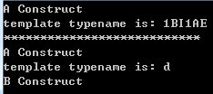

# C++17新特性

[https://blog.csdn.net/qq811299838/article/details/90371604](https://blog.csdn.net/qq811299838/article/details/90371604)

**目录**

[1.1 constexpr](https://blog.csdn.net/qq811299838/article/details/90371604)

[1.2 static_assert](https://blog.csdn.net/qq811299838/article/details/90371604)

[1.3 auto](https://blog.csdn.net/qq811299838/article/details/90371604)

[1.4 typename](https://blog.csdn.net/qq811299838/article/details/90371604)

[1.5 inline](https://blog.csdn.net/qq811299838/article/details/90371604)

[2.3 允许非类型模板参数进行常量计算](https://blog.csdn.net/qq811299838/article/details/90371604)

[2.4 条件分支语句初始化](https://blog.csdn.net/qq811299838/article/details/90371604)

[2.6 嵌套命名空间](https://blog.csdn.net/qq811299838/article/details/90371604)

[2.7 lambda表达式捕获*this的值](https://blog.csdn.net/qq811299838/article/details/90371604)

[2.8 枚举[类]对象的构造](https://blog.csdn.net/qq811299838/article/details/90371604)

[2.9 十六进制单精度浮点数字面值](https://blog.csdn.net/qq811299838/article/details/90371604)

[2.10 基于对齐内存的动态内存分配](https://blog.csdn.net/qq811299838/article/details/90371604)

[2.11 细化表达式的计算顺序](https://blog.csdn.net/qq811299838/article/details/90371604)

[2.12 模板类的模板参数自动推导](https://blog.csdn.net/qq811299838/article/details/90371604)

[2.13 简化重复命名空间的属性列表](https://blog.csdn.net/qq811299838/article/details/90371604)

[2.14 不支持、非标准的属性](https://blog.csdn.net/qq811299838/article/details/90371604)

[2.15 改写与继承构造函数](https://blog.csdn.net/qq811299838/article/details/90371604)

[2.16 内联变量](https://blog.csdn.net/qq811299838/article/details/90371604)

[2.17 用auto作为非类型模板参数](https://blog.csdn.net/qq811299838/article/details/90371604)

[3.1 __has_include](https://blog.csdn.net/qq811299838/article/details/90371604)

[4.1 fallthrough](https://blog.csdn.net/qq811299838/article/details/90371604)

[4.2 nodiscard](https://blog.csdn.net/qq811299838/article/details/90371604)

[4.3 maybe_unuse](https://blog.csdn.net/qq811299838/article/details/90371604)

# C++17

编译器版本：GCC 7.1、Clang 5.0

__cplusplus：201703L

编译选项：-std=c++17

# 1 关键字

## 1.1 constexpr

扩展constexpr使用范围，可用于if语句中，也可用于lambda表达式中。

例子1：

例子2：

## 1.2 static_assert

扩展static_assert用法，静态断言的显示文本可选。

如：

## 1.3 auto

扩展auto的推断范围

如：

## 1.4 typename

扩展用法，允许出现在模板的模板的参数中。

首先回顾一下typename的用法，①用于模板中，表示模板参数为类型；②用于声明某名字是变量名

如例1：

新特性下的typename用法，

如例2：

运行结果：

## 1.5 inline

扩展用法，可用于定义内联变量，功能与内联函数相似。inline可避免函数或变量多重定义的问题，如果已定义相同的函数或变量（且该函数或变量声明为inline），编译器会自动链接到该函数或变量。

如（不发生错误）：

# 2 语法

## 2.1 折叠表达式

用于变长参数模板的解包，只支持各种运算符（和操作符），分左、右折叠

如：

## 2.2 结构化绑定

用一对包含一个或多个变量的中括号，表示结构化绑定，但是使用结构化绑定时，须用auto关键字，即绑定时声明变量

例子1：

例子2：

## 2.3 允许非类型模板参数进行常量计算

非类型模板参数可传入类的静态成员

如：

## 2.4 条件分支语句初始化

在if和switch中可进行初始化

如：

## 2.5 聚合初始化

在初始化对象时，可用花括号进行对其成员进行赋值

如：

## 2.6 嵌套命名空间

简化多层命名空间的写法

如：

## 2.7 lambda表达式捕获*this的值

lambda表达式可捕获*this的值，但this及其成员为只读

如：

## 2.8 枚举[类]对象的构造

可以给枚举[类]对象赋值

如：

## 2.9 十六进制单精度浮点数字面值

以0x前缀开头的十六进制数，以f后缀的单精度浮点数，合并，就有了十六进制的单精度浮点数

如：

## 2.10 基于对齐内存的动态内存分配

谈到动态内存分配，少不了new和delete运算符，新标准中的new和delete运算符新增了按照对齐内存值来分配、释放内存空间的功能（即一个新的带对齐内存值的new、delete运算符重载）

函数原型：

参数说明：

size —— 分配的字节数。必须为alignment的整数倍。

alignment —— 指定的对齐内存值。必须是实现支持的合法对齐。

new的返回值：

成功，返回指向新分配内存起始地址的指针。

用法例子：

## 2.11 细化表达式的计算顺序

为了支持泛型编程和重载运算符的广泛使用，新特性将计算顺序进行的细化

如以下争议代码段：

为了解决该情况，新计算顺序规则为：

①后缀表达式从左到右求值。这包括函数调用和成员选择表达式。

②赋值表达式从右向左求值。这包括复合赋值。

③从左到右计算移位操作符的操作数。

## 2.12 模板类的模板参数自动推导

定义模板类的对象时，可以不指定模板参数，但必须要在构造函数中能推导出模板参数

如：

## 2.13 简化重复命名空间的属性列表

如：

## 2.14 不支持、非标准的属性

在添加属性列表时，编译器会忽略不支持的非标准的属性，不会发出警告和错误。

## 2.15 改写与继承构造函数

在类的继承体系中，构造函数的自动调用是一个令人头疼的问题。新特性引入继承与改写构造函数的用法。

例子1：

例子2：

例子3：

## 2.16 内联变量

见1.5

## 2.17 用auto作为非类型模板参数

当模板参数为非类型时，可用auto自动推导类型

如：

# 3 宏

## 3.1 __has_include

判断有没有包含某文件

如：

# 4 属性

## 4.1 fallthrough

用于switch语句块内，表示会执行下一个case或default

如：

## 4.2 nodiscard

可用于类声明、函数声明、枚举声明中，表示函数的返回值没有被接收，在编译时会出现警告。

如：

## 4.3 maybe_unused

可用于类、typedef、变量、非静态数据成员、函数、枚举或枚举值中。用于抑制编译器对没用实体的警告。即加上该属性后，对某一实体不会发出“没有用”的警告。

用法例子：

# 结语

本次检验C++17新特性使用了GCC编译器，对于Clang的支持性方面没有做出差异测试。若有问题，欢迎指出