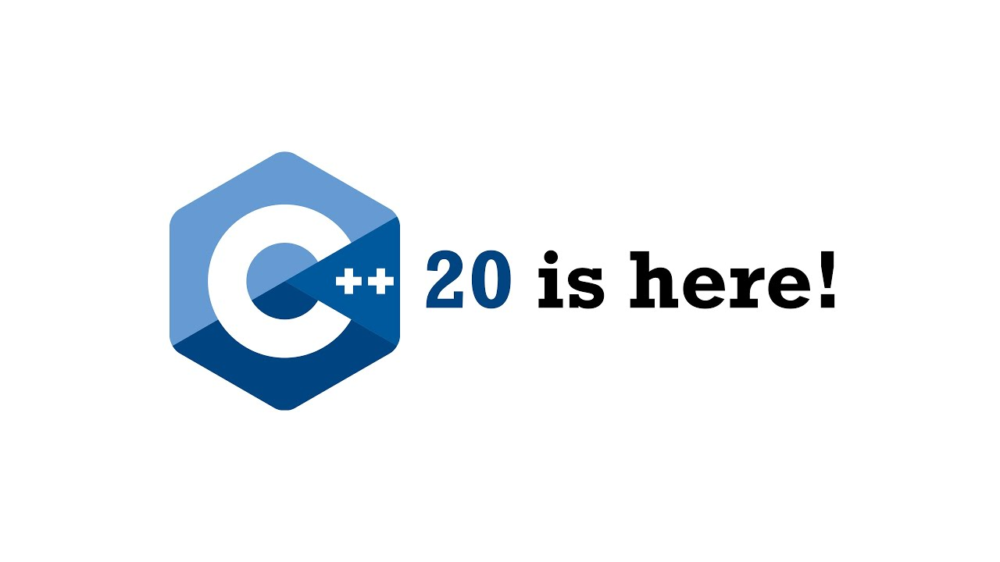

# C++20 新增特性

[https://zhuanlan.zhihu.com/p/137646370](https://zhuanlan.zhihu.com/p/137646370)



原文链接:

- 常量表达式(constexpr) 的更新
    - 用 using 引用 enum 类型
    - 格式化库(std::format)

## 新增关键字(keywords)

- concept
- requires
- constinit
- consteval
- co_await
- co_return
- co_yield
- char8_t

## 新增标识符(Identifies)

- import
- module

## 模块(Modules)

### 优点

- 没有头文件
- 声明实现仍然可分离, 但非必要
- 可以**显式**指定那些导出(类, 函数等)
- 不需要头文件重复引入宏 (include guards)
- 模块之间名称可以相同不会冲突
- 模块只处理一次, 编译更快 ()
  
    头文件每次引入都需要处理
    
- 预处理宏只在模块内有效
- 模块引入顺序无关紧要

### 创建模块

```
// cppcon.cpp 
export module cppcon; 
namespace CppCon { 
    auto GetWelcomeHelper() {  return "Welcome to CppCon 2019!";  } 
    export auto GetWelcome() { return GetWelcomeHelper();} 
}

```

### 引用模块

```
// main.cpp 
import cppcon; 
int main(){ 
    std::cout << CppCon::GetWelcome(); 
}

```

### import 头文件

- import <iostream>
- 隐式地将 `iostream` 转换为模块
- 加速构建, 因为 iostream 只会处理一次
- 和预编译头 (PCH) 具有相似的效果

## Ranges

**Ranges** 是什么 ?

- `Range` 代表一串元素, 或者一串元素中的一段
- 类似 begin/end 对

**好处**:

- 简化语法和方便使用

```
vector<int> data{11, 22, 33}; 
sort(begin(data), end(data)); 
sort(data); // 使用 Ranges

```

- 防止 begin/end 不配对
- 使变换/过滤等串联操作成为可能

**相关功能**

- **视图**(View): 延迟计算, 不持有, 不改写
- **Actions**: 即时处理(eagerly evaluated), 改写
- **Algorithms**: 所有接受 begin/end 对的算法都可用
- Views 和 actions 使用管道符`|`串联

### 例子

- 串联视图

```
vector<int> data {1, 2, 3, 4, 5, 6, 7, 8, 9, 10}; 
auto result = data | 
              views::remove_if([](int i) { return i % 2 == 1;}) | 
              views::transform([](int i) { return to_string(i);}); 
// result = {"2", "4", "6", "8", "10" };
// 注意 以上操作被延迟, 当你遍历result的时候才触发

```

- 串联actions

```
vector<int> data{4, 3, 4, 1, 8, 0, 8}; 
vector<int> result = data | actions::sort | actions::unique;

```

- 排序然后去重
- 操作会原地对`data`进行更改, 然后返回
- 过滤和变换

```
int total = accumulate (
                        view::ints(1) | 
                        view::transform([](int i) {return i * i;}) | 
                        view::take(10), 
                        0);

```

- `view::ints(1)` 产生一个无限的整型数列
- 平方
- 取前10个元素, 然后累加(accumulate)**所有的计算延迟到`accumulate`累加遍历的时候发生**

## 协程(Coroutines)

### 什么是协程

- 它是一个函数
- 具备如下关键字之一:
    - `co_wait`: 挂起协程, 等待其它计算完成
    - `co_return`: 从协程返回 (协程 `return` 禁止使用)
    - `co_yield`: 同 python yield, 弹出一个值, 挂起协程, 下一次调用继续协程的运行
    - `for co_await` 循环体

```
for co_await (for-range-declaration: expression) statement

```

**用处**

- 简化如下问题的实现:
    - generator
    - 异步I/O
    - 延迟计算
    - 事件驱动的程序

### 例子(VC++)

```
experimental::generator<int> GetSequenceGenerator( 
    int startValue, 
    size_t numberOfValues) { 
    for (int i = 0 startValue; i < startValue + numberOfValues; ++i){ 
        time_t t = system_clock::to_time_t(system_clock::now()); 
        cout << std:: ctime(&t); co_yield i; 
    } 
} 
int main() {
    auto gen = GetSequenceGenerator(10, 5); 
    for (const auto& value : gen) { 
        cout << value << "(Press enter for next value)" << endl; 
        cin.ignore(); 
    } 
}

```

## Concepts

- 对模板类和函数的模板形参的约束
- 编译期断言
- 可声明多个

### 如何定义

```
template<typename T> concept Incrementable = requires(T x) {x++; ++x;};

```

### 使用

```
template<Incrementable T> 
void Foo(T t); 

template<typename T> requires Incrementable<T> 
void Foo(T t); 

template<typename T> 
void Foo(T t) requires Incrementable<T>; 

void Foo(Incrementable auto t);

```

### 例子

- 具备`size()` 方法, 且返回`size_t`

```
template <typename T> concept HasSize = requires (T x){ 
    {x.size()} -> std::convertible_to<std::size_t>; 
};

```

- 组合concept

```
template<typename T> 
requires Incrementable<T> && Decrementable<T> 
void Foo(T t); 
// or 
template<typename T> 
concept Incr_Decrementable = Incrementable<T> && Decrementable<T>; 

template<Incr_Decrementable T> 
void Foo(T t);

```

## Lambda 表达式的更新

### [=, this] 需要显式捕获`this`变量

- C++20 之前 `[=]` 隐式捕获`this`
- C++20 开始 需要显式捕获this: `[=, this]`

### 模板形式的 Lambda 表达式

可以在`lambda`表达式中使用模板语法

```
[]template<T>(T x) {/* ... */}; 
[]template<T>(T* p) {/* ... */}; 
[]template<T, int N>(T (&a)[N]) {/* ... */};

```

**原因1**

- C++20之前: 获取 vector 元素类型, 你需要这么写

```
auto func = [](auto vec){ 
    using T = typename decltype(vec)::value_type; 
}

```

- C++20 你可以:

```
auto func = []<typename T>(vector<T> vec){ 
    // ... 
}

```

**原因2**: 方便获取通用lambda形参类型, 访问静态函数

- c++20 以前

```
auto func = [](auto const& x){ 
    using T = std::decay_t<decltype(x)>; 
    T copy = x; T::static_function(); 
    using Iterator = typename T::iterator; 
}

```

- C++20 开始

```
auto func = []<typename T>(const T& x){ 
    T copy = x; T::static_function(); 
    using Iterator = typename T::iterator; 
}

```

**原因3**: 完美转发

- pre C++20:

```
auto func = [](auto&& ...args) { 
    return foo(std::forward<decltype(args)>(args)...); 
}

```

- since C++20

```
auto func = []<typename …T>(T&& …args){ 
    return foo(std::forward(args)...); 
}

```

### Lambda 表达式捕获支持打包展开(Pack Expansion)

- Pre C++20

```
template<class F, class... Args> 
auto delay_invoke(F f, Args... args){ 
    return [f, args...]{ 
        return std::invoke(f, args...); 
    } 
}

```

- Since C++20

```
template<class F, class... Args> 
auto delay_invoke(F f, Args... args){ 
    // Pack Expansion:  args = std::move(args)...  
    return [f = std::move(f), args = std::move(args)...](){ 
        return std::invoke(f, args...); 
    } 
}

```

## 常量表达式(`constexpr`) 的更新

- `constexpr` 虚函数
    - `constexpr` 的虚函数可以重写非 `constexpr` 的虚函数
    - 非 `constexpr` 虚函数可以重写 `constexpr` 的虚函数
- `constexpr` 函数可以:
    - 使用 `dynamic_cast()` 和 `typeid`
    - 动态内存分配
    - 更改`union`成员的值
    - 包含 `try/catch`
        - 但是**不允许** **`throw`** **语句**
        - 在触发常量求值的时候 try/catch 不发生作用
        - 需要开启 `constexpr std::vector`

### `constexpr` string & vector

- `std::string` 和 `std::vector` 类型现在可以作为 `constexpr`
- 未来需要支持 `constexpr` 反射

## 原子(Atomic)智能指针

- 智能指针(shared_ptr)线程安全吗?
    - **是**: 引用计数控制单元线程安全, 保证对象只被释放一次
    - **否**: 对于数据的读写没有线程安全
- 如何将智能指针变成线程安全?
    - 使用 `mutex` 控制智能指针的访问
    - 使用全局非成员原子操作函数访问, 诸如: std::atomic_load(), atomic_store(), …
        - **缺点**: 容易出错, 忘记使用这些操作
    - C++20: `atomic<shared_ptr<T>>`, `atomic<weak_ptr<T>>`
        - 内部原理可能使用了`mutex`
        - 全局非成员原子操作函数标记为不推荐使用(deprecated)

### 例子

```
template<typename T> 
class concurrent_stack { 
    struct Node { 
        T t; 
        shared_ptr<Node> next; 
    }; 
    atomic_shared_ptr<Node> head; 
    // C++11: 去掉 "atomic_" 并且在访问时, 需要用 
    // 特殊的函数控制线程安全, 例如用std::tomic_load 
public: 
    class reference { 
        shared_ptr<Node> p; 
        <snip> 
    }; 
    auto find(T t) const { 
        auto p = head.load(); // C++11: atomic_load(&head) 
        while (p && p->t != t) 
            p = p->next; 
        return reference(move(p)); 
    } 
    auto front() const { 
        return reference(head); 
    } 
    void push_front(T t) { 
        auto p = make_shared<Node>(); 
        p->t = t; p->next = head; 
        while (!head.compare_exchange_weak(p->next, p)){ 
    } // C++11: atomic_compare_exchange_weak(&head, &p->next, p); }     
    void pop_front() { 
        auto p = head.load(); 
        while (p && !head.compare_exchange_weak(p, p->next)) {
        } // C++11: atomic_compare_exchange_weak(&head, &p, p->next); 
    } 
};

```

例子来自 Herb Sutter 的 N4162 论文

## 自动合流(Joining), 可中断(Cancellable) 的线程

- std::jthread
    - 头文件 <thread>
    - 支持中断
    - 析构函数中自动 Join
        - 析构函数调用 `stop_source.request_stop()` 然后 `join()`
- 中断线程执行
    - 头文件 <stop_token>
    - `std::stop_token`
        - 用来查询线程是否中断
        - 可以和`condition_variable_any`配合使用
    - `std::stop_source`
        - 用来请求线程停止运行
        - stop_resources 和 stop_tokens 都可以查询到停止请求
    - `std::stop_callback`
        - 如果对应的`stop_token` 被要求终止, 将会触发回调函数
        - 用法: std::stop_callback myCallback(myStopToken, []{ /* … */ });

### 例子

- 自动合流 Join

> std::thread 在析构函数中如果线程 joinable() 会直接调用 std::terminate() 直接导致程序退出
> 

```
void DoWorkPreCpp20() { 
    std::thread job([] { /* ... */ }); 
    try { 
        // ... Do something else ... 
    } catch (...) { 
        job.join(); 
        throw; // rethrow 
    } 
    job.join(); 
} 

void DoWork() { 
    std::jthread job([] { /* ... */ }); 
    // ... Do something else ... 
} // jthread destructor automatically calls join()

```

- 中断

```
std::jthread job([](std::stop_token token) {
    while (!token.stop_requested()) { 
        //... 
    } 
}); 
//... job.request_stop(); 
// auto source = job.get_stop_source() 
// auto token = job.get_stop_token()

```

## C++20 同步(Synchronization)库

- 信号量(Semaphore), 维基百科请走[这里](https://link.zhihu.com/?target=https%3A//zh.wikipedia.org/wiki/%25E4%25BF%25A1%25E5%258F%25B7%25E9%2587%258F)
    - 轻量级的同步原语
    - 可用来实现任何其他同步概念, 如: mutex, latches, barriers, …
    - 两种类型:
        - 多元信号量(counting semaphore): 建模非负值资源计数
        - 二元信号量(binary semaphore): 只有一个插孔, 两种状态, 最适合实现`mutex`
- `std::atomic` 等待和通知接口
    - 等待/阻塞在原子对象直到其值发生改变, 通过通知函数发送通知
    - 比轮训(polling)来的更高效
    - 方法
        - `notify_one()`
        - `notify_all()`
- 锁存器(Latch)和屏障(Barrier)
    - 辅助线程条件同步
- 锁存器(Latches)
    - 头文件<latch>
    - 线程的同步点
        - 线程将阻塞在这个位置, 直到到达的线程个数达标才放行, 放行之后不再关闭
    - 锁存器只会作用一次
- 屏障(Barriers)
    - <barrier>
    - 多个阶段
    - 每个阶段中
        - 一个参与者运行至屏障点时被阻塞，需要等待其他参与者都到达屏障点, 当到达线程数达标之后
        - 阶段完成的回调将被执行
        - 线程计数器被重置
        - 开启下一阶段
        - 线程得以继续执行

### std::atomic_ref

- 头文件<atomic>
- Atomic 引用
- 通过引用访问变为原子操作, 被引用对象可以为非原子类型

## 其他更新

### 指定初始化(Designated Initializers)

```
struct Data { 
    int anInt = 0; 
    std::string aString; 
}; 
Data d{ .aString = "Hello" };

```

### 航天飞机操作符 <=>

- 正规名称: **三路比较运算符**
- 三路比较结果如下
    - (a <=> b) < 0 // 如果 a < b 则为 true
    - (a <=> b) > 0 // 如果 a > b 则为 true
    - (a <=> b) == 0 // 如果 a 与 b 相等或者等价 则为 true
- 类似于C的strcmp 函数返回-1, 0, 1
- **一般情况**: 自动生成所有的比较操作符, 如果对象是结构体则逐个比较, 可以用下面代码代替所有的比较运算符
    - `auto X::operator<=>(const Y&) = default;`
- **高级情况**: 指定返回类型(支持6种所有的比较运算符)

**示例**:

```
class Point { 
    int x; int y; 
public: 
    friend bool operator==(const Point& a, const Point& b){ 
        return a.x==b.x && a.y==b.y; 
    } 
    friend bool operator< (const Point& a, const Point& b){ 
        return a.x < b.x || (a.x == b.x && a.y < b.y);  
    } 
    friend bool operator!=(const Point& a, const Point& b) { 
        return !(a==b); 
    } 
    friend bool operator<=(const Point& a, const Point& b) { 
        return !(b<a); 
    } 
    friend bool operator> (const Point& a, const Point& b) { 
        return b<a; 
    } 
    friend bool operator>=(const Point& a, const Point& b) { 
        return !(a<b); 
    } 
    // ... 其他非比较函数 ... 
}; 
#include <compare> class Point { 
    int x; int y; 
public: 
    auto operator<=>(const Point&)  const = default; // 比较操作符自动生成
    // ... 其他非比较函数 ... 
};

```

- 标准库类型支持 <=>
    - vector, string, map, set, sub_match, …
- 例如:

### 范围 for 循环语句支持初始化语句

- switch 语句初始化 (C++17):

```
struct Foo { 
    int value; int result; 
}; 
Foo GetData() { 
    return Foo(); 
} 

int main() { 
    switch (auto data = GetData(); data.value) { 
    case 1: 
        return data.result; 
    } 
}

```

- if 语句初始化 (C++17):

```
struct Foo { 
    int value; int result; 
}; 
Foo* GetData() {
  return new Foo(); 
} 

int main() { 
    if (auto data = GetData(); data) { 
        // Use 'data’ 
    } 
}

```

- 现在范围 for 循环同样支持初始化 (C++20):

```
struct Foo { 
    std::vector<int> values; 
}; 
Foo GetData() { 
    return Foo(); 
} 
int main() { 
    for (auto data = GetData(); 
    auto& value : data.values) { 
        // Use 'data’ 
    } 
}
 

```

### 非类型模板形参支持字符串

```
template<auto& s> void DoSomething() { 
    std::cout << s << std::endl; 
} 
int main() { 
    DoSomething<"CppCon">(); 
}

```

### [[likely]], [[unlikely]]

先验概率指导编译器优化

```
switch (value) { 
    case 1: break; 
    [[likely]] case 2: break; 
    [[unlikely]] case 3: break; 
}

```

### 日历(Calendar)和时区(Timezone)功能

- <choron> 增加日历和时区的支持
- 只支持公历(Gregorian calendar)
    - 其他日历也可通过扩展加入, 并能和 <chrono> 进行交互
- 初始化 年, 月 日的方法

```
// creating a year 
auto y1 = year{ 2019 }; 
auto y2 = 2019y; 
// creating a mouth
auto m1 = month{ 9 }; 
auto m2 = September; 
// creating a day 
auto d1 = day{ 18 }; 
auto d2 = 18d;

```

- 创建完整的日期

```
year_mouth_day fulldate1{2019y, September, 18d}; 
auto fulldate2 = 2019y / September / 18d; 
year_mouth_day fulldate3{Monday[3]/September/2019}; // Monday[3] 表示第三个星期一

```

- 新的事件间隔单位, 类似于秒, 分钟, …

```
using days = duration<signed interger type of at least 25bits, 
                      ratio_multiply<ratio<24>, hours::period>>; 
using weeks = ...; using mouths = ...; 
using years = ...;

```

- 例子

```
weeks w{1}; // 1 周 
days d{w}; // 将 1 周 转换成天数

```

- 新的时钟类型, (之前有 `system_clock`, `steady_clock`, `high_resolution_clock`):
    - `utc_clock`: represents Coordinated Universal Time (UTC), measures time since 00:00:00 UTC, Thursday, 1 January 1970, including leap seconds
    - `tai_clock`: represents International Atomic Time (TAI), measures time since 00:00:00, 1 January 1958, and was offseted 10 seconds ahead of UTC at that date, it does not include leap seconds
    - `gps_clock`: represents Global Positioning System (GPS) time, measures time since 00:00:00, 6 January 1980 UTC, it does not include leap seconds
    - `file_clock`: alias for the clock used for `std::filesystem::file_time_type`, epoch is unspecified
- 新增`system_clock`相关的别名

```
template<class Duration> 
using sys_time = std::chrono::time_point<std::chrono::system_clock, Duration>; 
using sys_seconds = sys_time<std::chrono::seconds>; 
using sys_days = sys_time<std::chrono::days>; 
// 用例: 
system_clock::time_point t =  sys_days{ 2019y / September / 18d }; // date -> time_point 
auto yearmonthday =  year_month_day{ floor<days>(t) }; // time_point -> date

```

- 日期 + 事件

```
auto t = sys_days{2019y/September/18d} + 9h + 35min + 10s; // 2019-09-18 09:35:10 UTC

```

- 时区转换

```
// Convert UTC to Denver 
time: zoned_time denver = { "America/Denver", t }; 
// Construct a local time in Denver: 
auto t = zoned_time{ 
    "America/Denver",  local_days{Wednesday[3] / September / 2019} + 9h 
}; 
// Get current local time: 
auto t = zoned_time{ current_zone(), system_clock::now() };

```

### std::span

- 头文件<span>
- 某段连续数据的”视图”
- 不持有数据, 不分配和销毁数据
- 拷贝非常快, 推荐复制的方式传参(类似 `string_view`)
- 不支持数据跨步(stride)
- 可通过运行期确定长度也可编译器确定长度

```
int data[42]; span<int, 42> a {data}; // fixed-size: 42 ints 
span<int> b {data}; // dynamic-size: 42 ints 
span<int, 50> c {data}; // compilation error 
span<int> d{ ptr, len }; // dynamic-size: len ints

```

### 特性测试宏

通过它可以判断编译器是否支持某个功能, 例如

- 语言特性
    - `__has_cpp_attribute(fallthrough)`
    - `__cpp_binary_literals`
    - `__cpp_char8_t`
    - `__cpp_coroutines`

### <version>

包含 C++ 标准库版本, 发布日期, 版权证书, 特性宏等

### `consteval` 函数

`constexpr` 函数可能编译期执行, 也可以在运行期执行, `consteval` 只能在编译器执行, 如果不满足要求编译不通过

### `constinit`

强制指定以常量方式初始化

```
const char* GetStringDyn() { 
    return "dynamic init"; 
} 
constexpr const char* GetString(bool constInit) { 
    return constInit ? 
        "constant init" : 
        GetStringDyn(); 
} 
constinit const char* a = GetString(true); // ✔ 
constinit const char* b = GetString(false); // ❌

```

### 用 `using` 引用 `enum` 类型

```
enum class CardTypeSuit { 
    Clubs, 
    Diamonds, 
    Hearts, 
    Spades 
}; 
std::string_view GetString(const CardTypeSuit cardTypeSuit) { 
    switch (cardTypeSuit) { 
    case CardTypeSuit::Clubs: 
        return "Clubs"; 
    case CardTypeSuit::Diamonds: 
        return "Diamonds"; 
    case CardTypeSuit::Hearts: 
         return "Hearts"; 
    case CardTypeSuit::Spades: 
         return "Spades"; 
    } 
} 
std::string_view GetString(const CardTypeSuit cardTypeSuit) { 
    switch (cardTypeSuit) { 
        using enum CardTypeSuit; // 这里 
        case Clubs: return "Clubs"; 
        case Diamonds: return "Diamonds"; 
        case Hearts: return "Hearts"; 
        case Spades: return "Spades"; 
    } 
}

```

### 格式化库(`std::format`)

不展开, 类似`Python` 的格式化,

```
std::string s = std::format("Hello CppCon {}!", 2019);

```

### 增加数学常量

再也不用为 M_PI 发愁啦

- 头文件 <numbers>
- 包含 e, log2e, log10e pi, inv_pi, inv_sqrt pi ln2, ln10 sqrt2, sqrt3, inv_sqrt3 egamma

### std::source_location

用于获取代码位置, 对于日志和错误信息尤其有用

### [[nodiscard(reason)]]

表明返回值不可抛弃, 加入理由的支持

```
[[nodiscard("Ignoring the return value will result in memory leaks.")]] 
void* GetData() { /* ... */ }

```

### 位运算

加入循环移位, 计数0和1位等功能

### 一些小更新

- 字符串支持 starts_with, ends_with
- map 支持 contains 查询是否存在某个键
- list 和 forward list 的 remove, remove_if 和 unique 操作返回 size_type 表明删除个数
- <algorithm> 增加 shift_left, shift_right
- `midpoint` 计算中位数, 可避免溢出
- `lerp` 线性插值 `lerp( float a, float b, float t )` 返回
- 新的向量化策略 `unsequenced_policy(execution::unseq)`

```
std::string str = "Hello world!"; 
bool b = str.starts_with("Hello"); // starts_with, ends_with 
std::map myMap{ std::pair{1, "one"s}, {2, "two"s}, {3, "three"s} }; 
bool result = myMap.contains(2); // contains, 再也不用  .find() == .end() 了

```

## 参考资料