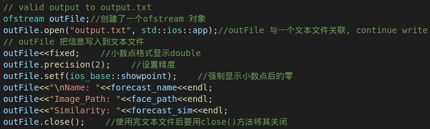
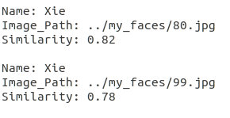
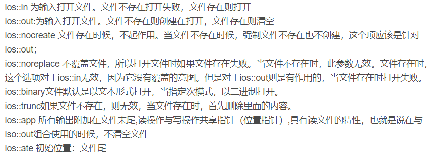
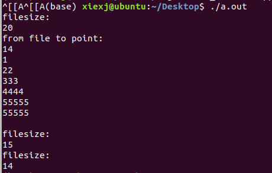

# c++ <fstream> 读写文件总结

[https://www.cnblogs.com/exciting/p/11165535.html](https://www.cnblogs.com/exciting/p/11165535.html)

在此之前我已经分别使用过这两种方法，我这里没有重新写代码，只po上我之前实际使用的

头文件都是<fstream>

方法一：





方法二：

```
fstream pos("./pos_scores.txt", fstream::in | fstream::out | fstream::trunc);
...
pos << pair_id <<"\t"<< cal << "\t" <<pos_left<<"\t"<<pos_right<<endl;
```

头文件都是<fstream>两种方法应该是接近一样的，所以我去网上找了更好的总结

**博客一**：[C++中简单的文本文件输入/输出](https://blog.csdn.net/francis_xd/article/details/78347595) 入门首选，但读写的格式类型比较简单了，稍微复杂一点就需要用结构体

**博客二**：[C/C++读写文本文件、二进制文件](https://blog.csdn.net/nichengwuxiao/article/details/78789225) 我的第一个读写二进制文件写法就抄的这里，我觉得c++的写法更简洁，所以我会将c++的例子搬过来

文本读：

文本写：

二进制读：

二进制写：

**博客三**：[fstream文件打开模式](https://www.cnblogs.com/qingtian224/p/5581528.html) 使用上面四个代码的格式，需要指定文件打开模式



**教程四：**[菜鸟教程](https://www.runoob.com/cplusplus/cpp-files-streams.html)，适合入门，每个都讲了点但是不完整

我自己补充了个完整的例子：



其中123.txt

123out.txt

效果是覆盖不是插入

**博客五**：[c++ 二进制文件读写](https://www.cnblogs.com/exciting/p/11041996.html) 这篇是我之前写的博客，那时要格式化的读写二进制文件，这个是留着我自己看的（因为我写了几篇c++读写的博客，以后我打算只看这篇了）

读取图片保存至binary.dat二进制文件

读binary.dat并进行特征比对