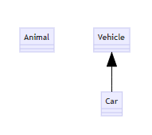
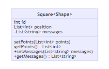
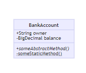
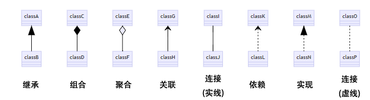
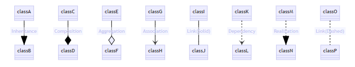
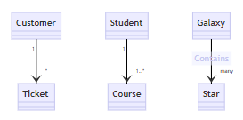
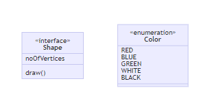

# Markdown mermaid

[https://blog.csdn.net/horsee/article/details/113883818](https://blog.csdn.net/horsee/article/details/113883818)

### 文章目录

- [Markdown mermaid种草(5)_ 类图](https://blog.csdn.net/horsee/article/details/113883818)

## 1 类图简介

 类图(Class diagram)是最常用的UML图，显示出类、接口以及它们之间的静态结构和关系；它用于描述系统的结构化设计.类图最基本的元素是类或者接口.

 类图是面向对象建模的主要构建模块.它用于应用程序结构的一般概念建模，以及将模型转换为编程代码的详细建模.类图也可用于数据建模.类图中的类表示主要元素、应用程序中的交互和要编程的类.

## 2 类图绘制

### 2.1 类

 UML 提供代表类成员的机制，如属性和方法，以及有关他们的其他信息.图表中一个类的单个实例包含三个隔块：

- 顶部隔块包含**类的名称**.粗体、居中，第一个字母大写.它还可能包含描述类性质的可选注释文本.
- 中部隔块包含类的**属性**.它们是左对齐的，第一个字母是小写字母.
- 底部隔块包含类可以执行的**操作**.它们也是左对齐的，第一个字母是小写字母.

```
classDiagram
    class BankAccount
    BankAccount : +String owner
    BankAccount : +Bigdecimal balance
    BankAccount : +deposit(amount)
    BankAccount : +withdrawl(amount)

```


 如上图所示，绘制出一个名为`BankAccount`的类，它有两个属性，分别是String类型的`owner`和Bigdecimal类型的`balance`，它有两个操作方法，分别是`deposit`和`withdrawl`，这两个操作方法的输入值均为`amount`.

 对应的markdown语法，首先以`classDiagram`作为引导，表示将要绘制的是类图.

 然后定义一个类，以`class`作为引导，空格后接上这个类的名称；

 接下来就是定义属性和方法了，都是以这个类的名称为开头，后面接上冒号，再接上类的不同作用域范围，注意，属性直接由类型引导，后面跟上属性名即可，而操作方法则以方法名为直接引导，后面括号加上返回的变量.

 关于类的作用域范围，以及属性和方法的定义细节，接下来将会详细说明.

### 2.2 定义一个类

 显式地定义一个类可以使用引导词`class`，如定义一个名为Animal的类： `class Animal`

 通过两个类间的关系可以隐式地定义两个类，如`Vehicle <|-- Car`，这定义了两个类，分别为`Vehicle`和`Car`. 其中，`Car`继承自`Vehicle`类.

> 命名约定：类名称应由字母数字（允许单码）和下划线字符组成.
> 

```
classDiagram
	class Animal
	Vehicle <|-- Car

```



### 2.3 定义类成员

 mermaid根据括号 （） 是否存在来区分属性和功能/方法. 具有 （） 的将被视为函数/方法，而其他则被视为属性.

 定义类成员有两种方法，不管使用哪一种方法，最后呈现的结果相同.

- 
  
    第一种方法是用一个冒号后面接着成员名称的方式，适用于一次定义一个成员.
    
- 
  
    第二种方法是用一个花括号 {} 把该类下的所有成员全部括起来，适用于一次性定义多个成员.
    

```
classDiagram
class BankAccount
 BankAccount : +String owner
 BankAccount : +BigDecimal balance
 BankAccount : +deposit(amount)
 BankAccount : +withdrawal(amount)

```


```
classDiagram
class BankAccount{
    +String owner
    +BigDecimal balance
    +deposit(amount)
    +withdrawl(amount)
}

```


### 2.4 定义返回类型

 对于类的成员函数，可能会涉及到返回值类型的问题. 那么如何定义类成员函数的返回值类型呢？注意以下语法：

```
classDiagram
class BankAccount{
    +String owner
    +BigDecimal balance
    +deposit(amount) bool
    +withdrawl(amount) int
}

```


 在成员函数（操作方法）的括号后添加空格和返回值类型. 在类图上就将显示冒号引导的返回值类型.

### 2.5 定义泛型类

 类定义中除了基本数据类型外，还有模板类（泛型），如`List<int>`，此时的定义方法如下：

 用波浪号替代泛型定义中的单尖括号.

```
classDiagram
class Square~Shape~{
    int id
    List~int~ position
    setPoints(List~int~ points)
    getPoints() List~int~
}

Square : -List~string~ messages
Square : +setMessages(List~string~ messages)
Square : +getMessages() List~string~
1234
```



 很遗憾，目前还不支持嵌套的泛型类定义`List<List<int>>`

### 2.6 定义类成员作用域

 类成员的作用域，或可见性，可以分为Public Private Protected Package/Internal;

```
classDiagram
class BankAccount{
    +String owner
    -BigDecimal balance
    #deposit(amount) bool
    ~withdrawl(amount) int
}

```


 如果需要定义抽象方法或静态方法，则只需要在括号后添加*或$符号即可：

```
classDiagram
 class BankAccount
 BankAccount: +String owner
 BankAccount: -BigDecimal balance
 BankAccount: +someAbstractMethod()*
 BankAccount: -someStaticMethod()$

```



 可以看出，抽象方法被标为斜体，静态方法被标注了下划线.

### 2.7 定义类间关系

 面向对象编程中的类间关系有继承、组合、聚合等，如下表所示为支持的种类：

[支持的种类](Markdown mermaid/1.csv)

```
classDiagram
classA <|-- classB
classC *-- classD
classE o-- classF
classG <-- classH
classI -- classJ
classK <.. classL
classM <|.. classN
classO .. classP

```



### 2.8 类间关系上的标签

 也可以在关系定义后添加文本表示注释：

```
classDiagram
classA --|> classB : Inheritance
classC --* classD : Composition
classE --o classF : Aggregation
classG --> classH : Association
classI -- classJ : Link(Solid)
classK ..> classL : Dependency
classM ..|> classN : Realization
classO .. classP : Link(Dashed)
12345678
```



### 2.9 实例数的表示

 类图中的 multiplicity 或 cardinality 表示链接到另一类一个实例的一个类的实例数.例如，一家公司将有一个或多位员工，但每位员工只为一家公司工作.

 不同的实例数表示包括:

- 
  
    `1` 仅有 1
    
- 
  
    `0..1` 0或者1
    
- 
  
    `1..*` 1或者更多
    
- 
    - `` 若干
- 
  
    `n` n {n>1}
    
- 
  
    `0..n` 0 到 n {n>1}
    
- 
  
    `1..n` 1 到 n {n>1}
    
    在给定箭头之前（可选）和引文（可选）之后，将基数文本置于引号内，可以很容易地定义实例数.
    

```
classDiagram
    Customer "1" --> "*" Ticket
    Student "1" --> "1..*" Course
    Galaxy --> "many" Star : Contains

```



 可以由上例看出，标注显示在箭头的旁边.

### 2.10 类注释

 类的类型有以下四种，以`<<`和`>>`括起来.

- `<<Interface>>` 接口类
- `<<abstract>>` 抽象类
- `<<Service>>` 服务类
- `<<enumeration>>` 枚举类

```
classDiagram
class Shape{
    <<interface>>
    noOfVertices
    draw()
}
class Color{
    <<enumeration>>
    RED
    BLUE
    GREEN
    WHITE
    BLACK
}
10111213
```



