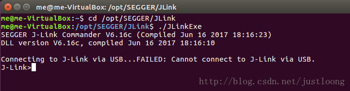

# STM32 Clion Ubuntu 配置

Complete 2021/03/30 

- 编译器arm-none-eabi-gcc arm-none-eabi-g++ arm-none-eabi-gdb
- IDE Clion
- OpenOCD
- Jlink
- STM32CubeMX
- 环境：ubuntu20.04

## Jlink

需要手动安装驱动以及编译相关软件

### 1.安装libusb

      如果J-Link是通过USB连接的，得先装libusb，README文件声称用apt-get install libusb，试下行不行，如果提示“无法找到软件包”，就得自己下载安装。
       在http://sourceforge.net/projects/libusb/files/libusb-1.0/下载(libusb官网，[http://www.libusb.org/](http://www.libusb.org/))，并安装

```bash
#解压软件并进入目录libusb-xxx

./configure
make 
sudo make install 

```

如果./configure 这条命令不行，建议用这个命令./configure --disable-udev

### 2.安装libreadline

JLinkExe会用到libreadline库，所以得把libreadline库装上。[http://cnswww.cns.cwru.edu/php/chet/readline/rltop.html](http://cnswww.cns.cwru.edu/php/chet/readline/rltop.html) 中Current Status选择下载，并安装，同1类似编译安装

### ****3.下载JLink驱动****

在https://www.segger.com/jlink-software.html并单独存放于一个文件夹，进入该文件夹

```bash
dpkg -i *.deb
```

### 4. 验证

```bash
cd /opt/SEGGER/JLink
./JLinkExe
```

出现如图所示，即成功

