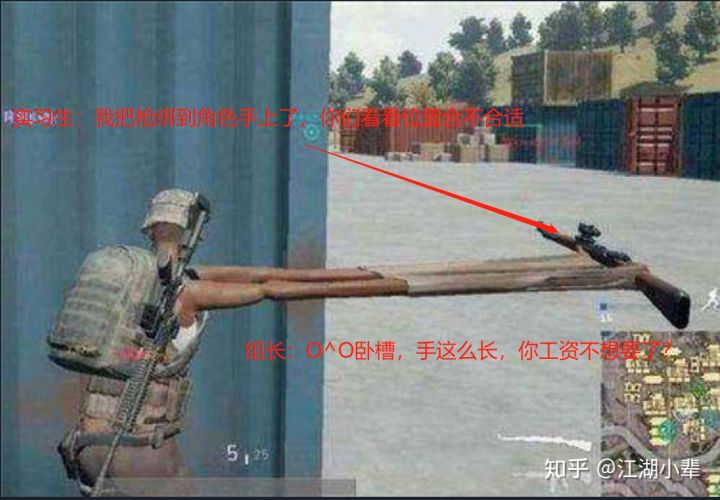
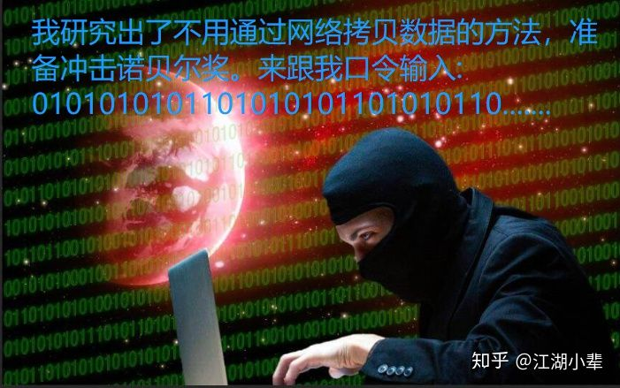
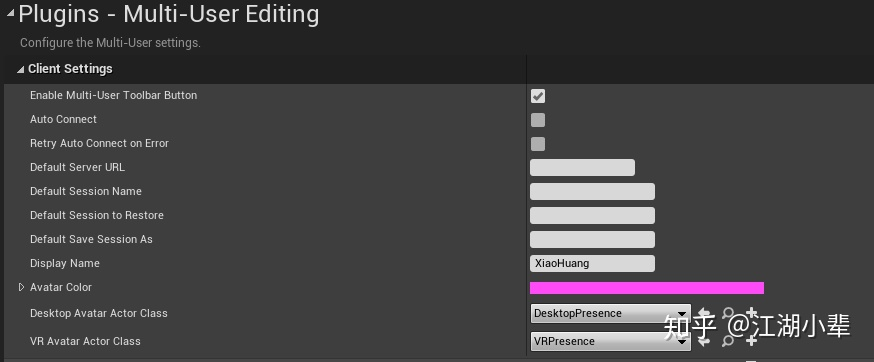
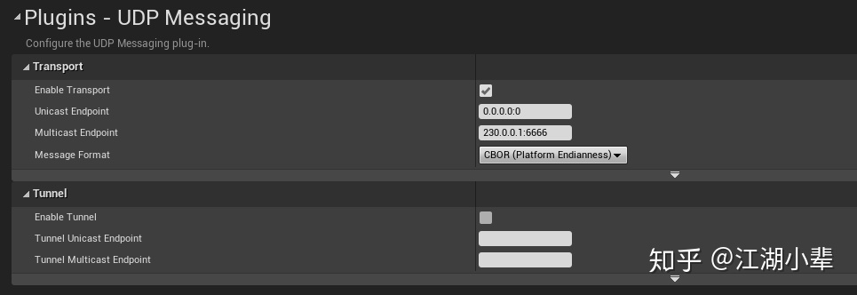
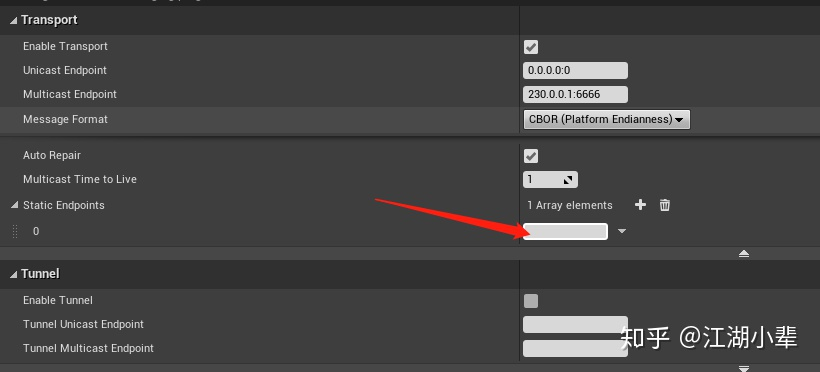
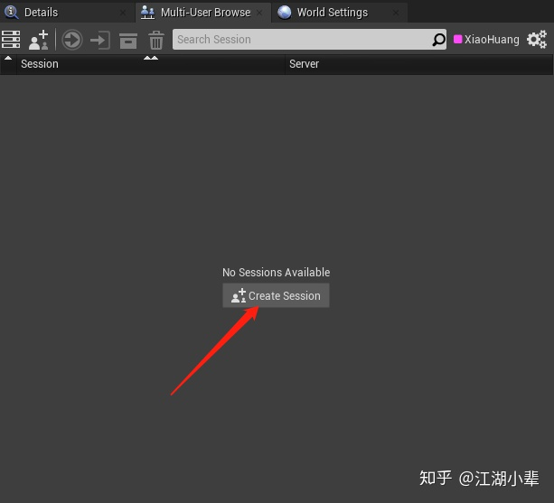
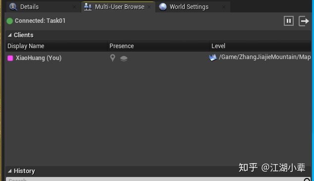
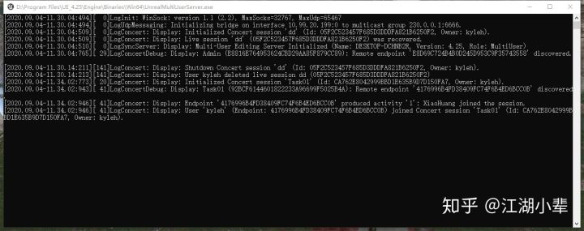
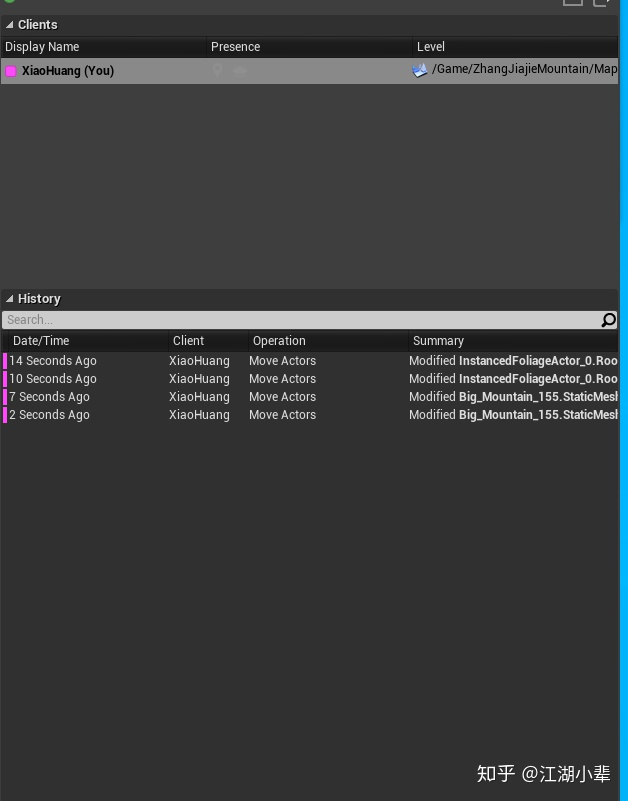
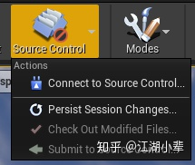

# UE4多人协作教程 - 知乎

[https://zhuanlan.zhihu.com/p/250207225?utm_source=wechat_session](https://zhuanlan.zhihu.com/p/250207225?utm_source=wechat_session)

文章转载自知乎，未经授权，仅为方便内部成员阅读，禁止向外传播。

---

本来录了一期视频，打算传B站来着，结果录完发现后面麦挂了声音没录进去，心态爆炸。我就把稿子放上来吧，视频有机会就补录，没机会就算了。

今天我们来讲UE4中的多用户编辑功能（Multi-User Editing）。通过它我们可以在UE4中实现多人运动，及多用户协同工作。

按文档的话来讲，通过多用户编辑，我们可以将虚幻编辑器的多个实例连接起来，以在共享编辑会话中展开协作，让我们的团队成员能够实时地构建同一个虚拟世界。意思就是说我们可以真正地实现，在团队中多人同时在一个项目中协同工作，而无需像传统流程一样不同人做完工作之后再通过SVN等版本控制方案合并不同人的工作，甚至是一个人做完工作共再将工程复制给其他人使用。避免了很多不必要的流程以及出错的可能性，而且在协同工作中也可以做到及时的交流与反馈。

该功能的好处是可以跨平台使用，我在Macbook Pro和windows端进行过跨平台的协同任务测试，因为两个操作系统下的操作完全一样，所以我认为仅演示Windows端就行了。

我们使用多用户比那就功能的前提是所有参与协同任务的用户所使用的引擎版本相同，项目工程状态相同，甚至项目名称也要相同。而且所有参与协同任务的主机要在一个局域网内，因为多人协作是不然无法做到不同主机间的数据传输。当然如果条件有限，团队成员不能在一处办公，我们也可以选择利用VPN进行连接，当所有人在同一个VPN环境下也是可以做到与服务器通讯的。

先简单说下多用户编辑功能的原理，跟我们玩的网络游戏一样，是利用经典的C/S模式进行工作的。首先我们要创建一个服务器，以供其他所有用户充当客户端进行连入。然后在服务器中创建协作任务，即Session会话，客户端可以定向地连入服务器中指定的Session会话，从另一个角度讲，我们的服务器可以同时承担多个Session的协同任务。

当客户端加入相应任务后，客户端传输操作指令信息到服务端，服务端再将接收到的所有指令信息广播给所有连入服务器相应会话的客户端。客户端的项目会根据接收到的指令将其他用户的操作在本机进行还原。实际过程中只有轻量级的指令信息的传输，而没有实际繁重的素材资产的传输。

因为所有修改都是通过消息指令进行的，所以加入网络协同工作的各客户端中项目的初始状态应保持完全一致。

举个例子，当一个摄像机在A客户端上的坐标为（0，0，0），在B客户端上的坐标为（100，100，100）。在A客户端将摄像机向X正方向移动10单位到（10，0，0），其将移动消息指令“向X移动+10单位”传输给服务端，服务端再将其广播给B客户端，B客户端将摄像机向X正方向移动10单位后，B客户端中摄像机的距离为（110，100，100），而不是A客户端中的（10，0，0）。在这种起始状态就有有误差的协同操作中，误差会不断增大。以至协同工作中出现各种神仙操作（配绝地求生巨大枪支图。配文字，A：我把枪绑定到角色手上了，你们看看位置合不合适；B：卧槽，这么大，你工资不想要了？！！）

为避免这种情况发生，我们应该提前保证

加入协同工作的用户都使用状态完全相同的项目，可以通过从同一个SVN或git进行Check Out，项目中人数少的话也可以直接通过复制项目来实现（A:你怎么给我传文件呀，没有网也没有U盘；B：我已经将项目解算出二进制数据了，我们来用二进制进行拷贝，01010101）

另一个需要注意的问题是，客户端在进行多人协同工作时，所有对操控指令的还原都是在虚拟沙盘中进行的，而不会对实际的本地项目进行更改。当用户将所以操作保存后，才会真正地将修改操作应用在本机项目中。也因此，当用户不保存修改直接退出协同工作时，其项目会还原为其原本的样子。

这一点的好处是不用担心用户因意外掉出协同工作而导致项目状态与其他人的状态不同，进而不能重新加入协同工作的问题出现。

当协同工作完成一个阶段时，所有人只需将线上修改保存下来，就能将协同工作的成果保留在自己的电脑上了。此时应该由一个人将工作成果Push回SVN服务器（或GIt），当再次需要进行协同工作时，以供所有人将各自电脑上的项目初始化为相同状态。

在协同操作中，无论是场景中的对象还是资源管理器中的文件，当它被一个用户进行操作时，这个物体对其他用户来说是锁定状态的。当操作完成后，锁定状态自动释放，这一点可以很好的避免由多个人同时对一个物体进行不同的操作，进而导致数据错乱的可能性，也避免了后续还要对操作对象进行差异校验，再进行merge合并不同文件等容易出问题的操作。当然除了自动锁定，用户也可以对资源进行手动锁定。

操作：

Settings->Plugins->Multi-User Editing->Enabled

重启引擎

Window->Developer Tools-> Multi-User Browser

可打开多用户快捷工具栏

设定用户名称与标识颜色，设定好后，其他用户可在场景内看到你，你也可以看到场景内其他用户的虚拟形象

保证计算机直接能够正确地进行相互通信

本地ip0.0.0.0:0或自己ip:0

服务端ip:6666，确保进行正确通信

创建会话服务

创建任务会话

输入任务会话名称

创建完成后用户自动进入了这个会话

命令行中也能看到服务器状态更新

现在所有操作都会被同步并储存在服务器中。

左边是挂起会话，可以暂停与服务器直接的数据交互。右边是退出当前会话。

我们在协同任务中可以进行的操作有有很多，比如资源资产修改，如蓝图、材质等，再比如Level中对象的修改，比如对象的位移、旋转、缩放等，我们也可以修改后期后期处理体积、灯光、声音等，我们甚至还可以对地形进行操作，比如刷地形，种草、种树等。

在场景中进行操作，可在历史界面中看到操作记录，里面有每一条操作指令的操作时间，操作用户，操作对象，和具体操作情况。

同样，操作信息也可以在命令行中看到。

当用户退出会话时，会发现所有的操作都被还原了，仿佛做了一场梦。人似秋鸿来有信，事如春梦了无痕。

当我们再次加入会话，会再次从服务器获取到所有操作信息，也包括了当我们不在线时其他用户的操作。我们会发现仿佛梦境重现，曾经的操作、留下的痕迹都又回来了。

当其他人操作时，我们可以看到其他角色虚拟形象，以及他们的操作。

当一个对象正在被其他人操作时，我们是无法同时对其操作的，知道其之前的操作被释放。

当然，我们也可以对资源管理器中的资源进行操作，而且我们还可以手动地对资源进行锁定，是其他人暂时失去对其操作的权限。方法是右键，选择Multi-User->Lock Asset。其他人也会同时看到一个锁定状态的资源。当然我们操作完对象后也要记得对资源进行解锁，避免其他人一直无法操作，除非你本意就是如此。

当我们完成一个阶段的协同操作后，我们们就需要将所有的操作保存到本地的项目中来。因为我们知道所有的指令信息都是保存在服务器中的，我们客户端的所有操作都是对服务器指令的模仿与还原，所以此时如果我们直接退出会话，我们会像刚才一样一切回归初始状态。

那么我们如何将所有改变保存呢。我们点击Source Control->Persist Session Changes.

此时会弹出一个对话框，我们可以选择将哪些操作保存到本地。好我们当然是要全部保存下来，然后我们点击Persist。

进度条走完之后我们便完成了保存。

好我们再次退出会话，我们发现所有改变都还在。真是精神感通若相遇，梦境幻境皆成真。

此时我们要注意，如果后续我们还要加入协同操作，就不要在离线状态下做其他的修改，不然会产生之前我们所说过的不同客户端之间的数据误差。当然最好的方法是，我们将项目提交到版本控制中，我个人使用git，我们提交一下。那么下次我们还需要进行协同操作时，只需要所有人从SVN同步一下即可。

UE4的多人协作功能非常强大，给我们的团队工作带来了极大的便捷性。处理日常工作外，我们也可以将多用户编辑功能应用中教学当中，这样所有人都可以在虚拟场景中跟着老师，看到老师的一步步操作， 甚至与老师进行互动，让老师当场指点所学成果。