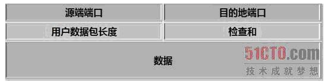

# TCP和UDP的区别和优缺点

[https://blog.csdn.net/xiaobangkuaipao/article/details/76793702](https://blog.csdn.net/xiaobangkuaipao/article/details/76793702)

1、TCP与UDP区别总结：
  1、 TCP面向连接 （如打电话要先拨号建立连接）; UDP是无连接 的，即发送数据之前不需要建立连接

2、TCP提供可靠的服务。也就是说，通过TCP连接传送的数据，无差错，不丢失，不重复，且按序到达;UDP尽最大努力交付，即不保证可靠交付

Tcp通过校验和，重传控制，序号标识，滑动窗口、确认应答实现可靠传输。如丢包时的重发控制，还可以对次序乱掉的分包进行顺序控制。

3、UDP具有较好的实时性，工作效率比TCP高，适用于对高速传输和实时性有较高的通信或广播通信。

4.每一条TCP连接只能是点到点的;UDP支持一对一，一对多，多对一和多对多的交互通信

5、TCP对系统资源要求较多，UDP对系统资源要求较少。

2、为什么UDP有时比TCP更有优势?

UDP以其简单、传输快的优势，在越来越多场景下取代了TCP,如实时游戏。

（1）网速的提升给UDP的稳定性提供可靠网络保障，丢包率很低，如果使用应用层重传，能够确保传输的可靠性。

（2）TCP为了实现网络通信的可靠性，使用了复杂的拥塞控制算法，建立了繁琐的握手过程，由于TCP内置的系统协议栈中，极难对其进行改进。

采用TCP，一旦发生丢包，TCP会将后续的包缓存起来，等前面的包重传并接收到后再继续发送，延时会越来越大，基于UDP对实时性要求较为严格的情况下，采用自定义重传机制，能够把丢包产生的延迟降到最低，尽量减少网络问题对游戏性造成影响。

3、UDP和TCP编程步骤也有些不同，如下：

**TCP:** 
 TCP编程的服务器端一般步骤是： 
  1、创建一个socket，用函数socket()； SOCKET SocketListen =socket(AF_INET,SOCK_STREAM, IPPROTO_TCP);
  2、设置socket属性，用函数setsockopt(); * 可选 
  3、绑定IP地址、端口等信息到socket上，用函数bind(); SOCKET_ERROR = bind(SocketListen,(const sockaddr*)&addr,sizeof(addr))
  4、开启监听，用函数listen()； SOCKET_ERROR == listen(SocketListen,2)
  5、接收客户端上来的连接，用函数accept()； SOCKET SocketWaiter = accept(SocketListen,

_Out_ struct sockaddr *addr

_Inout_ int *addrlen);
  6、收发数据，用函数send()和recv()，或者read()和write(); 
  7、关闭网络连接； closesocket(SocketListen);closesocket(SocketWaiter);
  8、关闭监听； SOCK_STREAM这种的特点是面向连接的，即每次收发数据之前必须通过connect建立连接，而SOCK_DGRAM这种是User Datagram Protocol协议的网络通讯，它是无连接的，不可靠的。TCP编程的客户端一般步骤是： 
  1、创建一个socket，用函数socket()； 
  2、设置socket属性，用函数setsockopt();* 可选 
  3、绑定IP地址、端口等信息到socket上，用函数bind();* 可选 
  4、设置要连接的对方的IP地址和端口等属性； 
  5、连接服务器，用函数connect()； 
  6、收发数据，用函数send()和recv()，或者read()和write(); 
  7、关闭网络连接；

```
int send(
  _In_  SOCKET s,         //向哪个socket发送，accept返回的socket。
  _In_  const char *buf,
  _In_  int len,
  _In_  int flags
);                               由于

```

send(SocketClient,(const char *)&fh,sizeof(fh),0);

recv(SocketClient,szbuf,sizeof(szbuf),0);**UDP:**
 与之对应的UDP编程步骤要简单许多，分别如下： 
  UDP编程的服务器端一般步骤是： 
  1、创建一个socket，用函数socket()； 
  2、设置socket属性，用函数setsockopt();* 可选 
  3、绑定IP地址、端口等信息到socket上，用函数bind(); 
  4、循环接收数据，用函数recvfrom(); 
  5、关闭网络连接； UDP编程的客户端一般步骤是： 
  1、创建一个socket，用函数socket()； 
  2、设置socket属性，用函数setsockopt();* 可选 
  3、绑定IP地址、端口等信息到socket上，用函数bind();* 可选 
  4、设置对方的IP地址和端口等属性; 
  5、发送数据，用函数sendto(); 
  6、关闭网络连接；

```
int recvfrom(
  _In_         SOCKET s,       //绑定的socket
  _Out_        char *buf,
  _In_         int len,
  _In_         int flags,
  _Out_        struct sockaddr *from,  //用来接收对方的
  _Inout_opt_  int *fromlen
);
```

int nres= recvfrom (pThis->m_socketListen,szBuf,sizeof(szBuf),0,(sockaddr*)&addrClient,&nSize);//0处标志位
 sendto(m_socketListen,szBuffer,nSize,0,(const sockaddr*)&addr,sizeof(sockaddr_in))
  TCP和UDP是OSI模型中的运输层中的协议。TCP提供可靠的通信传输，而UDP则常被用于让广播和细节控制交给应用的通信传输。

4、将socket设置为广播属性
 bool optval=true;
 setsockopt(m_socketListen,SOL_SOCKET,SO_BROADCAST,(const char *)&optval,sizeof(bool));

5、将Socket设置为非阻塞。
 //bool benable=true;
 //ioctlsocket(m_socketListen,FIONBIO,(u_long*)&benable);

6、Tcp头，20字节


7、UDP首部,8个字节

