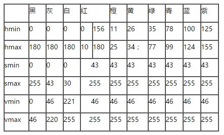

# HSV颜色分量范围

@Edwards Kenvay December 6, 2020 

[https://www.cnblogs.com/wangyblzu/p/5710715.html](https://www.cnblogs.com/wangyblzu/p/5710715.html)

文章转载自博客园，未经授权，仅为方便内部成员阅读，禁止向外传播。

一般对颜色空间的图像进行有效处理都是在HSV空间进行的，然后对于基本色中对应的HSV分量需要给定一个严格的范围，下面是通过实验计算的模糊范围（准确的范围在网上都没有给出）。

H:  0— 180

S:  0— 255

V:  0— 255

此处把部分红色归为紫色范围：

