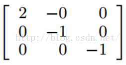
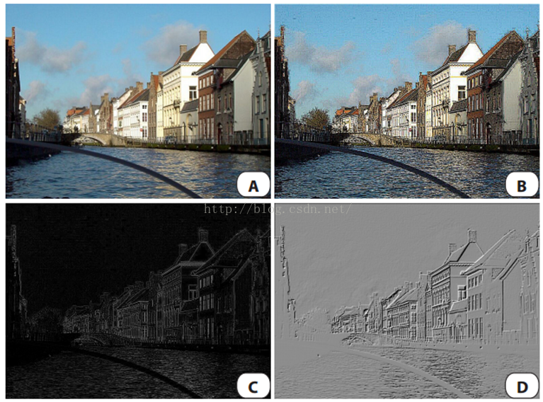
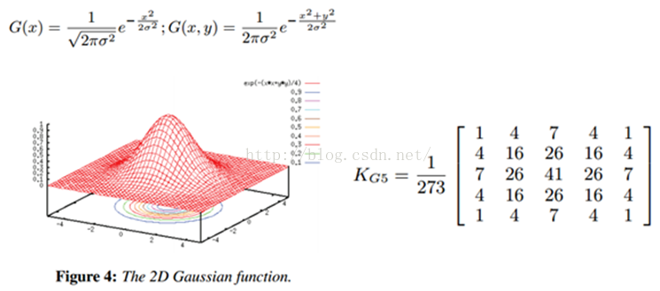
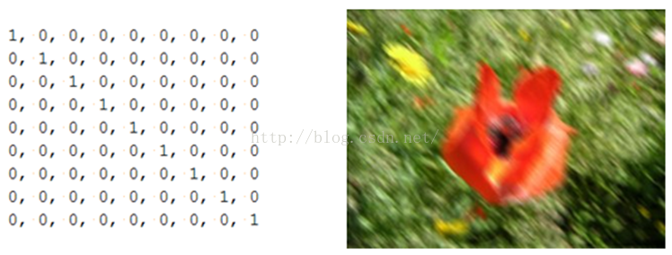
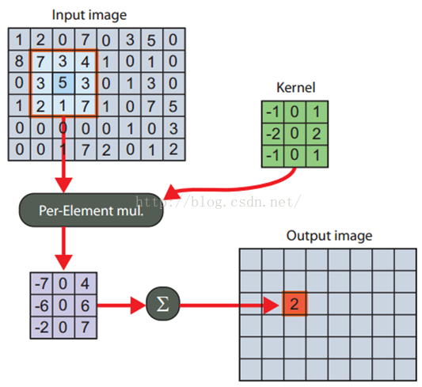
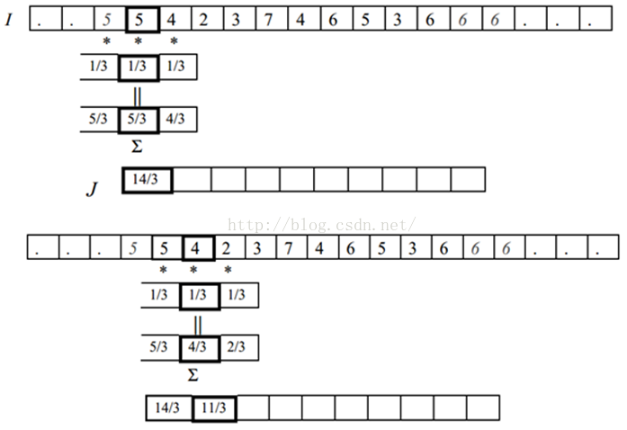
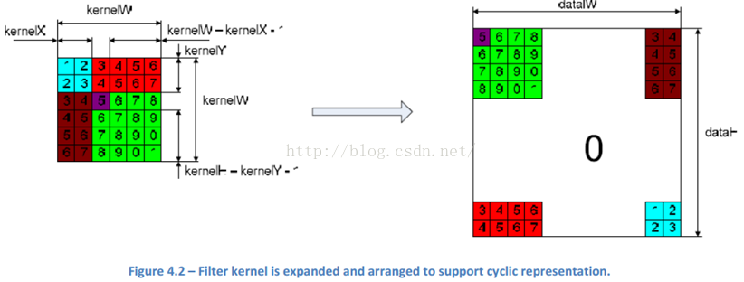
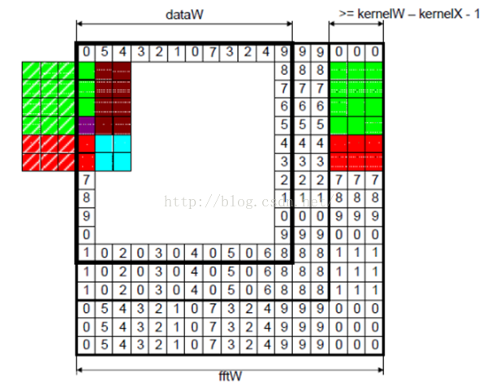
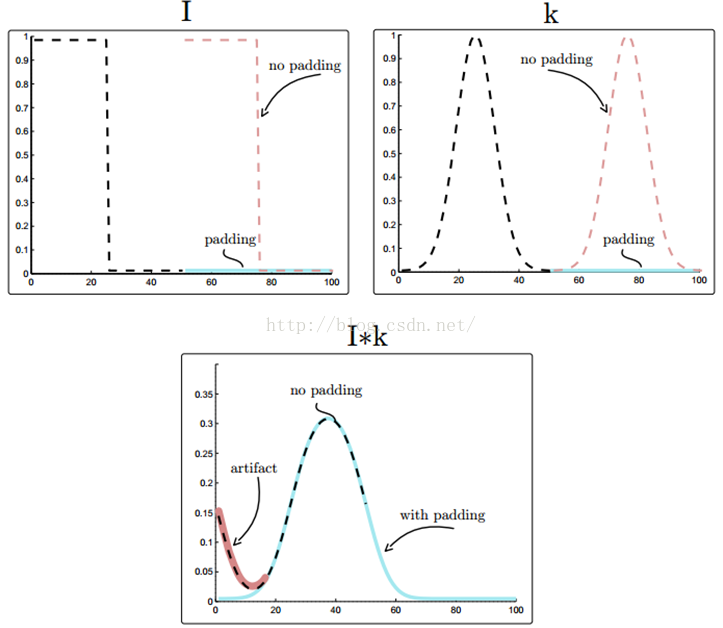

# 图像卷积与滤波的一些知识点

[https://blog.csdn.net/qq_35294564/article/details/81566009](https://blog.csdn.net/qq_35294564/article/details/81566009)

**（转自** zouxy09@qq.com**）**

**一、线性滤波与卷积的基本概念**

线性滤波可以说是图像处理最基本的方法，它可以允许我们对图像进行处理，产生很多不同的效果。做法很简单。首先，我们有一个二维的滤波器矩阵（有个高大上的名字叫卷积核）和一个要处理的二维图像。然后，对于图像的每一个像素点，计算它的邻域像素和滤波器矩阵的对应元素的乘积，然后加起来，作为该像素位置的值。这样就完成了滤波过程。

对图像和滤波矩阵进行逐个元素相乘再求和的操作就相当于将一个二维的函数移动到另一个二维函数的所有位置，这个操作就叫卷积或者协相关。卷积和协相关的差别是，卷积需要先对滤波矩阵进行180的翻转，但如果矩阵是对称的，那么两者就没有什么差别了。

Correlation 和 Convolution可以说是图像处理最基本的操作，但却非常有用。这两个操作有两个非常关键的特点：它们是线性的，而且具有平移不变性shift-invariant。平移不变性指我们在图像的每个位置都执行相同的操作。线性指这个操作是线性的，也就是我们用每个像素的邻域的线性组合来代替这个像素。这两个属性使得这个操作非常简单，因为线性操作是最简单的，然后在所有地方都做同样的操作就更简单了。

实际上，在信号处理领域，卷积有广泛的意义，而且有其严格的数学定义，但在这里不关注这个。

2D卷积需要4个嵌套循环4-double loop，所以它并不快，除非我们使用很小的卷积核。这里一般使用3x3或者5x5。而且，对于滤波器，也有一定的规则要求：

1）滤波器的大小应该是奇数，这样它才有一个中心，例如3x3，5x5或者7x7。有中心了，也有了半径的称呼，例如5x5大小的核的半径就是2。

2）滤波器矩阵所有的元素之和应该要等于1，这是为了保证滤波前后图像的亮度保持不变。当然了，这不是硬性要求了。

3）如果滤波器矩阵所有元素之和大于1，那么滤波后的图像就会比原图像更亮，反之，如果小于1，那么得到的图像就会变暗。如果和为0，图像不会变黑，但也会非常暗。

4）对于滤波后的结构，可能会出现负数或者大于255的数值。对这种情况，我们将他们直接截断到0和255之间即可。对于负数，也可以取绝对值。

**二、神奇的卷积核**

上面说到，对图像的滤波处理就是对图像应用一个小小的卷积核，那这个小小的卷积核到底有哪些魔法，能让一个图像从惨不忍睹变得秀色可餐。下面我们一起来领略下一些简单但不简单的卷积核的魔法。

**2.1、啥也不做**

哈哈，大家可以看到啥了吗？这个滤波器啥也没有做，得到的图像和原图是一样的。因为只有中心点的值是1。邻域点的权值都是0，对滤波后的取值没有任何影响。

下面我们动点真格的。

**2.2、图像锐化滤波器Sharpness Filter**

图像的锐化和边缘检测很像，首先找到边缘，然后把边缘加到原来的图像上面，这样就强化了图像的边缘，使图像看起来更加锐利了。这两者操作统一起来就是锐化滤波器了，也就是在边缘检测滤波器的基础上，再在中心的位置加1，这样滤波后的图像就会和原始的图像具有同样的亮度了，但是会更加锐利。

我们把核加大，就可以得到更加精细的锐化效果

另外，下面的滤波器会更强调边缘：

主要是强调图像的细节。最简单的3x3的锐化滤波器如下：

实际上是计算当前点和周围点的差别，然后将这个差别加到原来的位置上。另外，中间点的权值要比所有的权值和大于1，意味着这个像素要保持原来的值。

**2.3、边缘检测Edge Detection**

我们要找水平的边缘：需要注意的是，这里矩阵的元素和是0，所以滤波后的图像会很暗，只有边缘的地方是有亮度的。

为什么这个滤波器可以寻找到水平边缘呢？因为用这个滤波器卷积相当于求导的离散版本：你将当前的像素值减去前一个像素值，这样你就可以得到这个函数在这两个位置的差别或者斜率。下面的滤波器可以找到垂直方向的边缘，这里像素上和下的像素值都使用：

再下面这个滤波器可以找到45度的边缘：取-2不为了什么，只是为了让矩阵的元素和为0而已。

那下面这个滤波器就可以检测所有方向的边缘:

为了检测边缘，我们需要在图像对应的方向计算梯度。用下面的卷积核来卷积图像，就可以了。但在实际中，这种简单的方法会把噪声也放大了。另外，需要注意的是，矩阵所有的值加起来要是0.

**2.4、浮雕Embossing Filter**

浮雕滤波器可以给图像一种3D阴影的效果。只要将中心一边的像素减去另一边的像素就可以了。这时候，像素值有可能是负数，我们将负数当成阴影，将正数当成光，然后我们对结果图像加上128的偏移。这时候，图像大部分就变成灰色了。

下面是45度的浮雕滤波器

我们只要加大滤波器，就可以得到更加夸张的效果了

这种效果非常的漂亮，就像是将一副图像雕刻在一块石头上面一样，然后从一个方向照亮它。它和前面的滤波器不同，它是非对称的。另外，它会产生负数值，所以我们需要将结果偏移，以得到图像灰度的范围。

A：原图像。B：锐化。C：边缘检测。D：浮雕

**2.5、均值模糊Box Filter (Averaging)**

我们可以将当前像素和它的四邻域的像素一起取平均，然后再除以5，或者直接在滤波器的5个地方取0.2的值即可，如下图：

可以看到，这个模糊还是比较温柔的，我们可以把滤波器变大，这样就会变得粗暴了：注意要将和再除以13.

所以，如果你想要更模糊的效果，加大滤波器的大小即可。或者对图像应用多次模糊也可以。

**2.6、高斯模糊**

均值模糊很简单，但不是很平滑。高斯模糊就有这个优点，所以被广泛用在图像降噪上。特别是在边缘检测之前，都会用来移除细节。高斯滤波器是一个低通滤波器。

**2.7、运动模糊Motion Blur**

运动模糊可以通过只在一个方向模糊达到，例如下面9x9的运动模糊滤波器。注意，求和结果要除以9。

这个效果就好像，摄像机是从左上角移动的右下角。

**三、卷积的计算**

对图像处理而言，存在两大类的方法：空域处理和频域处理！空域处理是指直接对原始的像素空间进行计算，频率处理是指先对图像变换到频域，再做滤波等处理。

**3.1、空域计算-直接2D卷积**

**3.1.1、2D卷积**

直接2D卷积就是一开始说的那样，对于图像的每一个像素点，计算它的邻域像素和滤波器矩阵的对应元素的乘积，然后加起来，作为该像素位置的值。

直接的实现也称为暴力实现brute force，因为它严格按照定义来实现，没有任何优化。当然了，在并行实现里面，它也是比较灵活的。另外，也存在一个优化版本，如果我们的kernel是separable可分的，那么就可以得到一个快5倍左右的卷积方法。

**2.1.2、边界处理**

那卷积核遇到图像边缘怎么办？例如图像顶部的像素，它的上面已经没有像素了，那么它的值如何计算？目前有四种主流的处理方法，我们用一维卷积和均值滤波来说明下。

我们在1D图像中，用每个像素和它的二邻域的平均值来取代它的值。假设我们有个1D的图像I是这样的：

对非图像边界的像素的操作比较简单。假设我们对I的第四个像素3做局部平均。也就是我们用2,3和7做平均，来取代这个位置的像素值。也就是，平均会产生一副新的图像J，这个图像在相同位置J (4) = (I(3)+I(4)+I(5))/3 = (2+3+7)/3 = 4。同样，我们可以得到J(3) = (I(2)+I(3)+I(4))/3 =(4+2+3)/3 = 3。需要注意的是，新图像的每个像素都取决于旧的图像，在计算J (4)的时候用J (3)是不对的，而是用I(3)，I(4)和I(5)。所以每个像素都是它和它邻域两个像素的平均。平均是线性的操作，因为每个新的像素都是旧像素的线性组合。

对卷积，也有必须要考虑的情况是，在图像边界的时候，怎么办？J(1)的值应该是什么？它取决于I(0)，I(1)和I(2)。但是我们没有I(0)呀！图像左边没有值了。有四种方式来处理这个问题：

1）第一种就是想象I是无限长的图像的一部分，除了我们给定值的部分，其他部分的像素值都是0。在这种情况下，I(0)=0。所以J(1) = (I(0) + I(1) + I(2))/3 = (0 + 5 + 4)/3= 3. 同样，J(10) = (I(9)+I(10)+I(11))/3 = (3+ 6 + 0)/3 = 3.

2）第二种方法也是想象I是无限图像的一部分。但没有指定的部分是用图像边界的值进行拓展。在我们的例子中，因为图像I最左边的值I(1)=5，所以它左边的所有值，我们都认为是5 。而图像右边的所有的值，我们都认为和右边界的值I(10)一样，都是6。这时候J(1) = (I(0) + I(1) + I(2))/3 = (5 + 5 + 4)/3= 14/3. 而J(10) = (I(9)+I(10)+I(11))/3 = (3 + 6 + 6)/3 = 5。

3）第三种情况就是认为图像是周期性的。也就是I不断的重复。周期就是I的长度。在我们这里，I(0)和I(10)的值就是一样的，I(11)的值和I(1)的值也是一样的。所以J(1) = (I(0) + I(1) + I(2))/3= (I(10) + I(1)+ I(2))/3 = (6 + 5 + 4)/3 = 5 。

4）最后一种情况就是不管其他地方了。我们觉得I之外的情况是没有定义的，所以没办法使用这些没有定义的值，所以要使用图像I没有定义的值的像素都没办法计算。在这里，J(1)和J(10)都没办法计算，所以输出J会比原图像I要小。

这四种方法有各自的优缺点。如果我们想象我们使用的图像只是世界的一个小窗口，然后我们需要使用窗口边界外的值，那么一般来说，外面的值和边界上的值是几乎相似的，所以第二种方法可能更说得过去。

**2.2、频域计算-快速傅里叶变换FFT卷积**

这个快速实现得益于卷积定理：时域上的卷积等于频域上的乘积。所以将我们的图像和滤波器通过算法变换到频域后，直接将他们相乘，然后再变换回时域（也就是图像的空域）就可以了。

o表示矩阵逐元素相乘。那用什么方法将空域的图像和滤波器变换到频域了。那就是鼎鼎大名的Fast Fourier Transformation 快速傅里叶变换FFT（其实，在CUDA里面，已经实现了FFT了）。

要在频域中对一副图像进行滤波，滤波器的大小和图像的大小必须要匹配，这样两者的相乘才容易。因为一般滤波器的大小比图像要小，所以我们需要拓展我们的kernel，让它和图像的大小一致。

因为CUDA中的FFT实现是周期的，所以kernel的值也要安排成这样，以支持这种周期性。

为了保证图像边界的像素也可以得到响应输出，我们也需要拓展我们的输入图像。同时，拓展的方式也要支持周期表达。

如果只是使用卷积定理，没有对输入进行任何修改的话，那么我们得到的是周期卷积的结果。但这可能不是我们要的，因为周期卷积会对输入数据进行周期填补，引入一些artifacts。

给定N长度的I和K，为了得到线性卷积，我们需要对I和K进行zero padding。为什么要补0，因为DFT假定了输入是无限和周期的，周期是N。

如上图，对于I和K，如果没有padding的话，隐含着会假定I和K是周期的，以他们的长度N为周期。图中本来N长度的I和K都是黑色虚线的部分，然后如果没有padding，隐含着就会在N之外，加上同样的无数个I，如红色虚线部分，加上了一个周期。对K也是这样。如果是zero padding的话，在黑色虚线的其他地方都全是0了，如图中蓝色部分。将I和K卷积，如果没有padding，如黑色虚线，会有红色那部分的artifact。如果有padding，就是蓝色实线。

**四、实验代码**

这是第二部分的Matlab实验代码：

1. clear,close all, clc
2.  
3. %% readimage
4. image =imread('test.jpg');
5.  
6. %% definefilter
7. % -----Identity filter -----
8. kernel =[0, 0, 0
9. ​                     0, 1, 0
10. ​                     0, 0, 0];
11.  
12. % -----Average Blur -----
13. kernel =[0, 1, 0
14. ​                     1, 1, 1
15. ​                     0, 1, 0] / 5;
16.  
17. % -----Gaussian Blur -----
18. kernel =fspecial('gaussian', 5 , 0.8);
19.  
20. % -----Motion Blur -----
21. kernel =[1, 0, 0, 0, 0
22. ​                     0, 1, 0, 0, 0
23. ​                     0, 0, 1, 0, 0
24. ​                     0, 0, 0, 1, 0
25. ​                     0, 0, 0, 0, 1] / 5;
26. ​                    
27. % -----Edges Detection -----
28. kernel =[-1, -1, -1
29. ​                     -1, 8, -1
30. ​                     -1, -1, -1];
31.  
32. % -----Sharpen filter -----
33. kernel =[-1, -1, -1
34. ​                     -1, 9, -1
35. ​                     -1, -1, -1];
36. ​                    
37. % -----Emboss filter -----
38. kernel =[-1, -1, 0
39. ​                     -1,  0,1
40. ​                     0,   1,1];
41. ​                    
42. %% convolethe image with defined kernel or filter
43. result =zeros(size(image));
44. result(:,:, 1) = conv2(double(image(:, :, 1)), double(kernel), 'same');
45. result(:,:, 2) = conv2(double(image(:, :, 2)), double(kernel), 'same');
46. result(:,:, 3) = conv2(double(image(:, :, 3)), double(kernel), 'same');
47.  
48. %% showthe result
49. imshow(image);
50. figure
51. imshow(uint8(result))

**五、参考文献**

[1] Correlation and Convolution.pdf

[2] [Lode's Computer GraphicsTutorial Image Filtering](http://lodev.org/cgtutor/filtering.html)