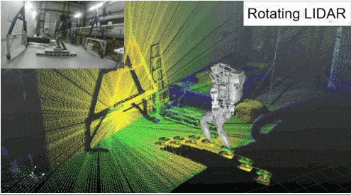
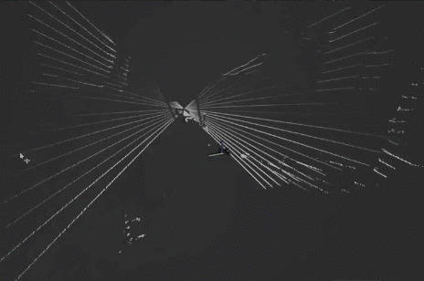
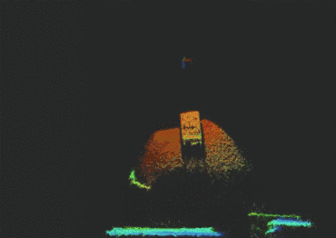
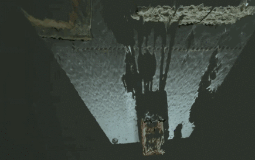

# 相机视场角和焦距干货   LIDAR、ToF相机、双目相机如何科学选择

[https://blog.csdn.net/weixin_30802367/article/details/112219769](https://blog.csdn.net/weixin_30802367/article/details/112219769)

全网最详细的ORB-SLAM2精讲：原理推导+逐行代码分析！

本文提纲

- 传感器参数及定义
- LIDAR & ToF 相机 & 双目相机介绍
1. 工作原理
2. 优缺点

三维成像技术原理和应用想必大家在之前的文章中了解过啦，今天想给大家比较一下LIDAR、ToF 相机以及双目相机，并且还有一些直观的测试数据来展示各自的优缺点，是骡子是马拉出来溜溜！

### 传感器参数及定义

如何评判传感器的好坏呢？这是有统一的标准的，划分为性能参数和非性能参数。下面分别介绍一下。

### 性能参数

先说一下性能参数，这个大家比较关心，主要有以下几个方面：

- 视场角(Field of view)：传感器可感知的角度，包括垂直视场角和水平视场角
- 密度(Density) ：在两个采样点之间的角度步长(angular step size)

一般纵向横向密度有所不同，一般在整个系统中视场角越大，密度就会越小

- 分辨率(Resolution)：视场角和密度的乘积
- 距离精确度(Depth accuracy)：距离精确度能够反映测量距离和实际距离的偏差 (要与分辨率区分)，它是传感器的一个重要参数。分辨率很高的传感器可以分辨细节特征，即使距离有一些偏差。传感器可以有高的分辨率但距离精确度一般
- 分辨率(Depth resolution)：沿着测量坐标轴下的可测量距离
- 最大最小探测距离(Minimum and maximum range)：传感器的可感知距离

与材料、环境光亮度、反射率有关

反映获取数据的速度

### 非性能参数

不要小看非性能参数，它也会限制在实际中的应用。

使传感器隔绝外界灰尘，防水溅以及水浸入

一般有以太网、USB、法尔接口、CAN总线、串口

物理接口一般使用以太网

硬件、软件(广播触发、网路定时)、无同步

- 软件接口
- 还有一些其他的参数 例如温度、健康报告、惯性测量单元、通用输入输出等

### 终端使用对权重的影响

在不同的应用场景下我们要知道什么是最重要的参数，例如室内地面机器人需要检测障碍物，避免碰撞，这时垂直视场角最重要。下面表格中展示了一些应用场景下重要的参数，橘色是重要的，黄色是相对重要的。

举几个例子：

地图测绘---可测量最大距离

强调安全性的系统---帧率，因为需要及时获取三维数据进行判断

UAV(Unmanned Aerial Vehicle)---重量

UGV(Unmanned Ground Vehicle)---垂直视场角、最小探测距离

### LIDAR

### 原理

LIDAR工作原理是发射激光到物体表面，然后接收物体的反射光信号，比较与初始激光的不同从而计算出距离。单束LIDAR利用旋转镜等机械部件可在两个方向上机械转向扫描。如下图所示

也有无扫描部件的固态LIDAR的研究，但目前还不能商业化，现在主要是用单点或者机械扫描小数目的点。

优点有：

- 探测距离远，探测范围在10m到2km之间，距离主要取决于激光的能量和脉冲持续时间
- 有固定的误差模型，误差在厘米级别
- 水平视场角通常很宽，是因为有旋转镜或者可旋转的发射器和探测器
  
    Velodyne公司的LIDAR(左图)水平视场角是363°，但垂直视场角很小，Carnegie Robotics SL(右图)有270度球面视场角
    

- 垂直视场角可以很大，这取决于机械部件和激光光束的安置

缺点有：

- 成本高，目前低成本的LIDAR仍未出现，目前LIDAR发展趋势是低成本、小型化、固态化
- 密度非对称且扫描到的点数有限
- 发射光束受环境干扰，相对被动成像技术来说更易受雨雪天气影响
- 有移动部件，含有不平整的窗口，给封装带来困难
- 扫描耗时，无法即刻获取数据，且需要后期处理来补偿机械部件导致的运动模糊误差

### ToF相机

ToF相机采用的是连续波调制，比较物体返回信号和发射信号的相位差可得距离信息，可实现像素级别测量。

zamb是最大可测量距离，根据公式可知小的频率有更大探测距离。如下图所示

一般来说光探测器分辨率较低，测量距离有限，可增大光的发射功率来增大发射距离，

一般常用正弦波信号，但是正弦波相位每隔2π就会重复，这意味着接收信号有重叠，影响测量准确性，

所以可以采用多个调制频率，真实距离就是多个调制频率共同测到的值，但这会导致追踪反射信号时间变长，从而增加了信噪比，并且在相机或物体运动的情况下造成运动漂移。

当然ToF相机也有很多优点：

- 场景纹理丰富与否不影响测量
- 具有即时的垂直水平视场角
- 距离误差是线性的
- 对于运动的障碍物产生的阴影较窄
- 无移动部件

缺点有：

- 相比于双目分辨率更低，
- 积分时间长会增加信噪比，若相机或被测物体运动则产生运动模糊
- 受多路径光线返回的影响深度数据畸变
- 环境光过强影响反射信号的探测
- 视场角一般小于60度
- 输出的是点云数据并非图像

### 双目立体视觉相机

双目原理与ToF完全不同，双目成像类似于人的双眼，通过左右相机的拍摄图像的差异(视差)来确定距离，这种差异与物体的远近距离成反比，就像你会觉得距离近的物体会移动的更多，无限远的物体几乎不动一样。

提前标定可以得到畸变参数和相机基线距离、焦距等参数，那么我们就可以利用视差来计算出物体的距离，这就是对应点匹配。因此对应点匹配的准确度是深度信息准确度的关键。

目前有许多方案来解决对应点匹配问题，比较新的方法是神经网络，但它还不是一种非常稳健高效的方案。

另一个需要强调的是相机有视差搜索范围(disparity search range)，如果不指定视差搜索范围，许多算法的性能会下降。大的视差搜索范围意味着相机能够看清更近的物体，但是计算量增大，将使得相机帧率下降。

与其他相机相比，双目优点有：

- 无移动部件，仅由两张二维照片获得深度信息，分辨率和采样密度没有限制，如果想增加分辨率，虽然会使得算法计算量增加，校正过程也变得繁琐，但并不存在物理性限制
- 可以很灵活的选择视场角和基线，垂直视场角可以很大，调节范围在10到230度
- RGB图像信息与深度信息同时可以从双目相机中获得，而配有RGB摄像头的ToF相机还需要两种数据的融合。

但是，双目也存在一些缺点：

- 双目的准确性受表面纹理影响，成像非常依赖物体表面的纹理，所以双目适用于纹理丰富的场景，或者采用主动成像的方法——用带有图案的结构光投影，通过反射回来的变形图案来来解决对应点匹配的问题。双目相机在测绘和安保领域有重要作用，因为在这些工作场景纹理信息很丰富。
- 两个相机视野中的障碍物有所不同，因此会产生重影
- 由于双目基于三角法原理，因此随着距离的增加，误差是非线性的，这比LIDAR的线性误差还要糟糕，需要在后期算法处理中进行建模补偿从而提高准确性，不过这也和双目相机没有探测的最大距离限制有关

### 三维采样数据比较

该数据来自来自the DARPA Robotics Challenge

在机器人走楼梯的场景下，分别利用DARPA的扫描型LIDAR和MIT SL双目传感器的三维数据进行机器人的足迹规划来爬楼梯。在视频正常播放速度下，SL能够让机器人移动的很快，并且没有碰到障碍物，但是扫描型LIDAR必须要随时间加速数据，但视场角很宽广，能够看到整个场景，而SL只能看到一部分。

接下来是在人靠近棋盘并拿起棋子的场景下，对LIDAR、ToF相机、双目相机进行测试。

### LIDAR

视场角较宽；但捕捉并且确认人类困难；水平和垂直方向的密度不均匀；

返回像素混叠(mixed-pixel returns)，LIDAR接收到桌子部分返回的信号和地板返回的信号但无法分辨它们，于是给出了一个错误的中间值

可以看到这个数据实时性更好，但点云稀疏。LIDAR扫描速率越快，实时性就会好，但数据点会比较稀疏，反之想要得到细节更丰富的场景扫描速率就会慢。

总而言之，得益于它的测量距离长并且视场角宽广，LIDAR适用于汽车、飞机等高速交通工具和需要高转向速率的系统。

### ToF相机

低成本相机：

低分辨率、低帧率；视场角窄；棋子不可见；

手电筒效应，采用红外线发射器，可以看到照亮了近距离的物体，但背景非常暗；

二分之一的地板消失；存在mid-air returns

工业相机：

高分辨率、高帧率；近距离物体失真；有物体遮挡的墙面弯曲；

由于多路径信号返回导致地板失真；混合像素返回(mixed-pixel returns)

总体来看，ToF相机适合室内环境的使用，例如对近距离物体的扫描和手势识别。

### 双目相机

视场角宽，高帧率；数据密度高，可看清棋盘上的棋子；能输出与场景匹配的颜色图像；

由于镜面反射导致出现地面以下的数据点；棋子在墙上有影子导致墙面部分图像失真

总的来说，双目相机适用于环境光充足的户外环境，或者用于不能够主动投射光的军事应用。

### 3D传感器测试

对于ToF和双目传感器来说，它们小巧便携，且成本低廉，在室内环境里优势格外突出。

接下来我们会定量地测试这些传感器性能表现，比较它们的不同，并展示一些极端情况下的性能结果。

### ToF&双目室内场景比较

这个场景是室内的玄关，可以看到地面和墙面较低的部分，还包括一些地面上的物品，如灭火器和急救箱。

两个相机拍摄的图是俯视方向，来自同一角度。

双目视场角比较宽，对距离稍微远一些的墙面和地面上的物品也可以看到，细节和距离远远超过ToF相机，但是墙面有缺失，且墙面上的纹理没有还原出来。

ToF相机能够接收到比较强的近距离反射信号，所以对近距离的墙面还原度很好，但是远距离信号弱，在加上噪声的影响导致无法识别。

这两幅图拍摄方向都是在探测器之上，并向下倾斜一些。

我们可以看到，双目水平垂直视场角都很宽阔，无论近距离远距离物体都能探测到，对场景细节的重现很丰富。

而ToF相机在对没有纹理的墙壁更能准确成像，但对远距离的场景无法成像。

### 极端情况测试

在少数特殊情况下，传感器性能可能会出现下降，例如在驾驶这样的安全性要求极高场景下，即使是小概率极端情况也会造成严重的后果，因此我们也要关注这些情况下的性能。

这个场景里有瓷砖地板、玻璃等特殊材质，ToF相机接收到的可能是多次折射后的光线，会有散射畸变，因此图里会出现墙壁弯曲和地板凹陷。

在50m的隧道里释放烟雾，用3D激光器和双目相机进行测试，右图是激光器和双目的彩色点云数据俯视图，双目相机成像类似人眼，因此在烟雾中准确性会下降，但仍然能够分辨出物体。而激光在烟雾中传播距离大大降低，性能急剧下降。

双目采用的二维RGB相机会有过曝光现象，当强光直接射进镜头导致反射和散射，出现光晕，从而丢失一些数据，但不会影响其他区域数据的采集的准确性。

### 不同的材料测试

室内环境中物品杂乱，那这些不同材质的物品会对性能有影响吗？so我们采集36个室内环境常见的材料对LIDAR、ToF相机、双目相机分别在环境光和卤素红外线强照明两种条件下进行测试。

A厂家LIDAR测试图

LIDAR对于环境光照明和红外线照明具有相似的性能表现，但LIDAR存在一个奇怪的现象，如图中蓝色方框里，会有一个向相机靠近的的偏移。

B厂家LIDAR测试图

B厂家比A厂家LIDAR噪声在环境光下多50%，在红外线强照明下多40%。经比较A厂家的LIDAR性能更好，看来不同厂家的产品差距还是挺大的。

双目相机测试图

双目相机基线距为7cm，可以看到对于纹理较少的黄铜、镜子等的成像噪声很多，这也证实了双目确实不适合纹理较少的场景。

### 总结

人无完人，当然也没有任何场景都适用的超能三维传感器，它们都会有限制条件和极端情况，所以不能直接照搬别人的方案，其他人用了这个传感器有不错的效果，不意味着在你的应用场景下会有同样好的效果，毕竟如人饮水冷暖自知呀。

如何找到你心中的完美3D传感器呢？那就得知道哪些是和应用相关的重要的性能参数和非性能参数，要了解在应用中会出现哪些极端情况，比较这些传感器在极端情况下工作状况如何，有时候可能需要牺牲一两个特性参数去优化最重要的那个参数。

在此提供一些资源供大家参考：

Carnegie Robotics

https://carnegierobotics.com/evs/

https://carnegierobotics.com/support/

一些公司&产品列表

全网最详细的ORB-SLAM2精讲：原理推导+逐行代码分析！