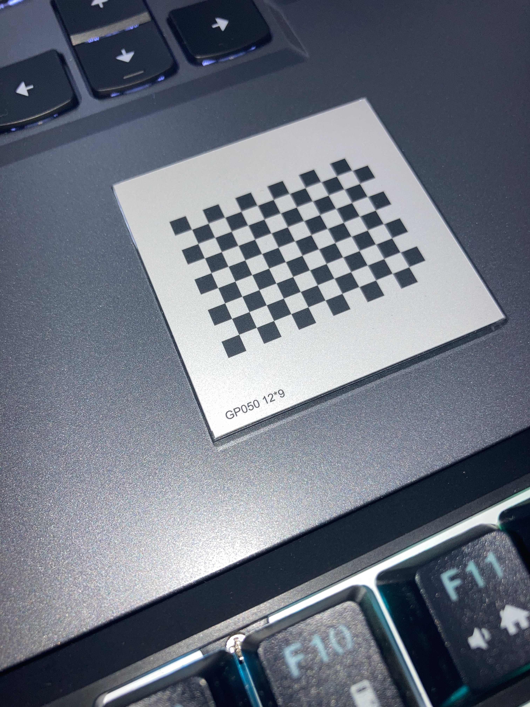
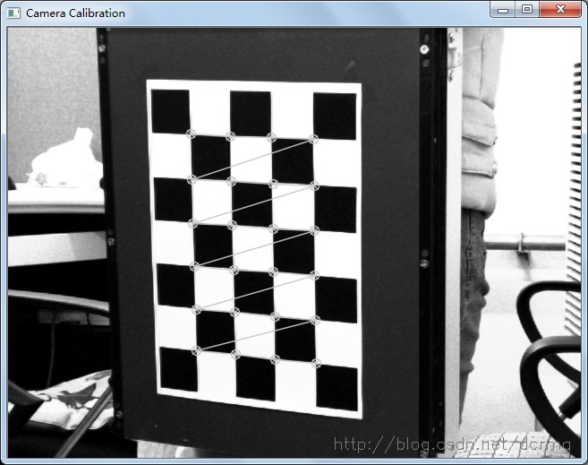
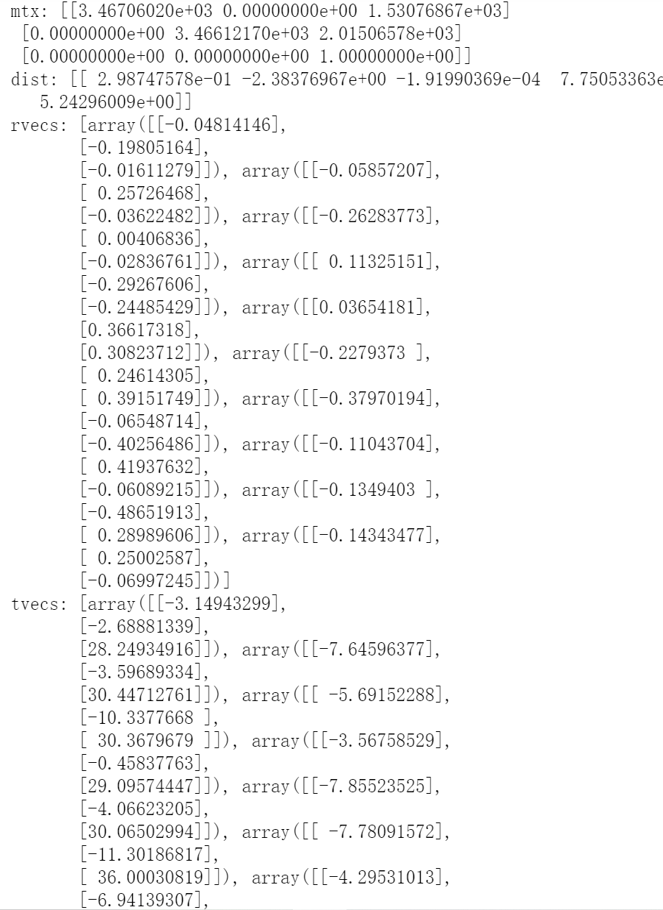
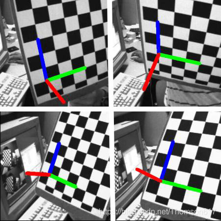

# 相机参数矩阵标定

@王逸骏 July 7, 2021 

# 0、写在前面：

准确来说这个项目应该叫三维重建。本质上我们是利用二维的图片通过技术手段推算出某个物体在三维世界原本的坐标，姿态（相对于拍摄相机而言）。而这个转换的关键就是内参矩阵（又说相机参数矩阵），它相当于透过二维看向三维的密钥。这个技术手段总的来说分为两个步骤：①标定，获取内参矩阵。②重构，可以判断内参矩阵是否正确，以最终确定标定算法是否正确。

本文实验标定对象为棋盘，这是进行标定学习的经典工具。

# 1、配置环境：

笔者目前采用的工具方案为：python+opencv库，编辑器为anoconda。已知还可以采用①matlab的方案，不需要运用编程语言，在matlab内可一步到位。②C语言方案，笔者没有研究过，理论是可替代python，语言不是该项目的最核心工具，matlab和opencv这样的图像处理工具才是。

笔者的工具方案配置教程：在anoconda里直接输入!pip install opencv-python如图:

注意，调用这个库时，应写为：import cv2，因为cv2才是opencv在python中的库名字。

```python
!pip install opencv-python 
```

# 2、相机标定：

相机标定就是获取相机各种参数的过程，这个过程本涉及到复杂的数学运算，但opencv的标定函数使其变得非常容易。

## 1）准备材料：

用需要标定的相机拍摄标定板，以不同的姿态，角度，位置拍摄，大约10~20张。



## 2）对每一张图片获取角点信息

利用findChessboardCorners函数即可：这里的角点专指的是标定板上的内角点，这些角点与标定板的边缘不接触。

可利用drawChessboardCorners函数绘制被成功标定的角点

```python
for fname in images:
    img = cv2.imread(fname)
    gray = cv2.cvtColor(img, cv2.COLOR_BGR2GRAY)
    size = gray.shape[::-1]
    ret, corners = cv2.findChessboardCorners(gray, (x, y), None)
    #print(corners)
```

效果图类似如图



## 3）对每一张标定图片，进一步提取亚像素角点信息

为了提高标定精度，需要在初步提取的角点信息上进一步提取亚像素信息，降低相机标定偏差，常用的方法是cornerSubPix函数

```python
#在原角点的基础上寻找亚像素角点
        corners2 = cv2.cornerSubPix(gray, corners, (5, 5), (-1, -1), criteria)
```

## 4）相机标定

获取到棋盘标定图的内角点图像坐标之后，就可以使用calibrateCamera函数进行标定，计算相机内参和外参系数，

```python
# 标定
ret, mtx, dist, rvecs, tvecs = cv2.calibrateCamera(obj_points, img_points, (3000,4000), None, None)#size图片尺寸，未设置，tuple类型
```

mtx：内参矩阵

dist：畸变系数

rvecs：旋转向量

tvecs：平移向量

效果如图：



# 3、姿态重构

这个步骤相当于验证获取的参数是否正确

对标定结果进行评价的方法是通过得到的摄像机内外参数，对空间的三维点进行重新投影计算，得到空间三维点在图像上新的投影点的坐标，对空间三维坐标点进行反向投影的函数是projectPoints

```python
# project 3D points to image plane
    imgpts, jac = cv2.projectPoints(axis, rvecs, tvecs, mtx, dist)
```

我们可以通过在图片中画出一个向量来直观显示

```python
img = draw(img,corners2,imgpts) 
    cv2.imwrite("review2"+ '.jpg', img)
    cv2.imshow('showme',img)
```

效果如图：



# 4、总结

能得到内参矩阵和重构后如图的向量图便视为本次试验成功。

本文参考了网络上的大量文章，笔者自己便是通过这些文章进行学习的，如有新的观点或方法，欢迎修改或添加

[https://blog.csdn.net/lzydelyc/article/details/105362140](https://blog.csdn.net/lzydelyc/article/details/105362140)

[https://blog.csdn.net/dcrmg/article/details/52939318](https://blog.csdn.net/dcrmg/article/details/52939318)

[https://blog.csdn.net/Thomson617/article/details/103987952](https://blog.csdn.net/Thomson617/article/details/103987952)

[https://panchuangai.blog.csdn.net/article/details/104822209](https://panchuangai.blog.csdn.net/article/details/104822209)

本实验代码如下：

[Untitled](相机参数矩阵标定/5.html)