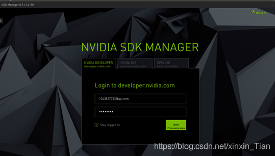
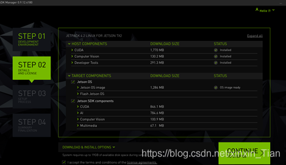
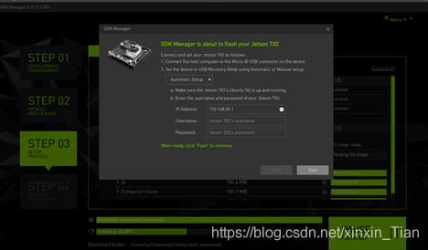
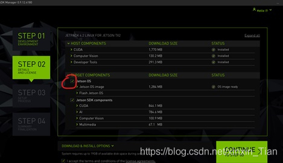

# Jetson tx2刷机（1.0）

@cloud xu January 13, 2021 

大家好，我是络羊

今天来向大家介绍一下Jetson tx2的刷机全过程

不过在此之前要先调试好环境

首先，你需要一台安装有ubuntu 18.04系统的主机（我这里用的是笔记本）（~~不是windows系统也不是虚拟机）~~

其次，在nvidia官网注册一个nvidia的账号用于下载jetpack 4.3时使用（在启动sdkmanager时也需要登录）

下载sdk Manager( jetpack 4.3版本)

下载完成后,安装即可

我们的刷机之旅正式开始


> 第一步，让tx2进入刷机模式
> 

注意：在这一步你需要很快的手速


1.关闭tx2，使其处于关机状态（本来就没开机的忽略这一步）

2.插入电源，启动tx2，并在2.5~3.5秒内完成下面的操作

3.按一下power键开机(按下后松开，稍微有一定的按键时长)

4.按下REC(RECOVERY FORCE)不要松开

5.再按下RST(reset按下松开,稍微有一定的按键时长)

6.REC保持两秒后松开

然后，tx2就会处在待刷机状态啦

就像


此时，连接的显示屏会显示处于未启动状态（亮黄灯）

再用usb-c端连接tx2，usb端连接主机

这步就完成了

> 第二步，用sdkmanager刷机
> 

在控制台输入sdkmanager 启动它

启动后开始

填写刚注册的账号



step1: 把所有的都勾上，并把target Hardware选择jetson tx2 点击CONTINUE进入下一步

step 2: 选择同意 勾选左下角 i accept… 然后选择 continue 进行下一步（这里会下载相应的安装包在主机端）



下载完成后，按continue进入 step 3.

等你的电脑跳出这个界面



这时，你的tx2的系统已经安装完毕了，与tx2连接的显示屏就会出现加载。

待其加载完毕，这时显示屏显示红色，并需要对tx2进行设置（是否自动登录取决于自己的需求）


设置完毕后，显示屏会出现我们熟悉的绿色（nvidia的产品都是绿色）


最后等结束就好了

但是，在这过程中可能会出现一系列问题

比如：


这时就需要你冷静面对了

要相信


> 针对部分问题的解决方法
> 
1. tx2 因无法从网上下载东西而导致安装失败

这种情况当然是给tx2联网啦


不过，很不幸，没有连天线的tx2接受网络的能力就像是没有能力，因为它所可以接收到的信号范围极小


不过还是有方法的：
1.用手机开热点，并把手机靠在tx2上（用你的手机尽量靠近它），让它能连上你的网，并且能有好的信号

2.用网线将tx2连上路由器（能上网的路由器）

根据以上方法操作，然后再次操作就行了

2.针对重复装机时，系统镜像重复安装的问题

重新打开sdkmanager，重新再来一次

不过   **不选择 jetson OS！！！**

这样的会就重装jetson sdk compentence部分，减少因重复安装系统所浪费的时间



3.网非常的慢

这时因为ubuntu本身的源是处于外网的

所以我们要换源

以下是换源步骤：

```jsx
sudo cp /etc/apt/sources.list /etc/apt/sources.list.bak    #为防止误操作后无法恢复，先备份原文件sources.list
sudo gedit /etc/apt/sources.list #删除或注释掉原Ubuntu的源 更换为清华的源,亲测可用
```

在sources.list中输入

```jsx
deb http://mirrors.tuna.tsinghua.edu.cn/ubuntu-ports/ bionic-updates main restricted universe multiverse
deb-src http://mirrors.tuna.tsinghua.edu.cn/ubuntu-ports/ bionic-updates main restricted universe multiverse
deb http://mirrors.tuna.tsinghua.edu.cn/ubuntu-ports/ bionic-security main restricted universe multiverse
deb-src http://mirrors.tuna.tsinghua.edu.cn/ubuntu-ports/ bionic-security main restricted universe multiverse
deb http://mirrors.tuna.tsinghua.edu.cn/ubuntu-ports/ bionic-backports main restricted universe multiverse
deb-src http://mirrors.tuna.tsinghua.edu.cn/ubuntu-ports/ bionic-backports main restricted universe multiverse
deb http://mirrors.tuna.tsinghua.edu.cn/ubuntu-ports/ bionic main universe restricted
deb-src http://mirrors.tuna.tsinghua.edu.cn/ubuntu-ports/ bionic main universe restricted
```

保存后打开新终端执行下面代码

```jsx
sudo apt-get update
```

这样在tx2需要东西的时候可以从国内的网上下，会比从国外的网上下快很多！！！

> 参考文档
> 

[https://blog.csdn.net/xinxin_Tian/article/details/104756866](https://blog.csdn.net/xinxin_Tian/article/details/104756866)