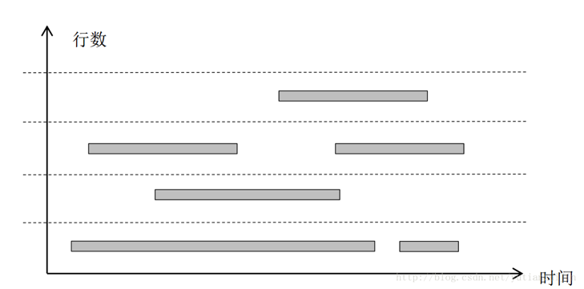
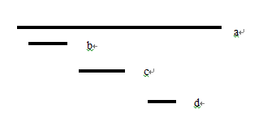
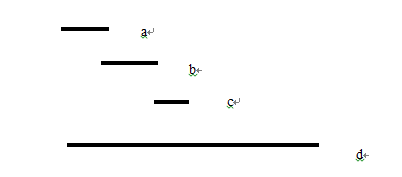
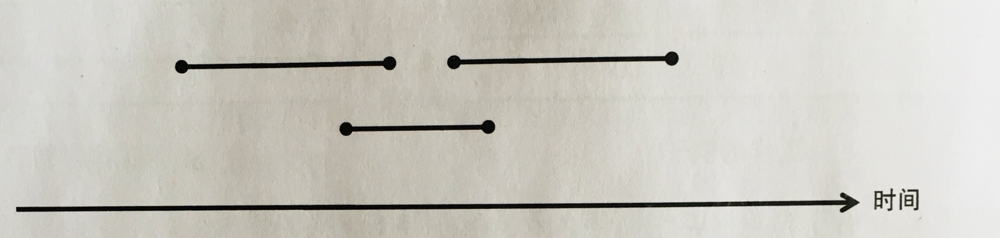
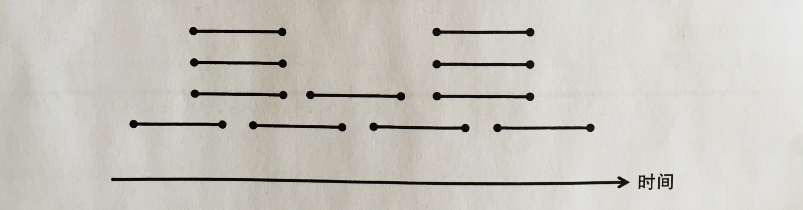
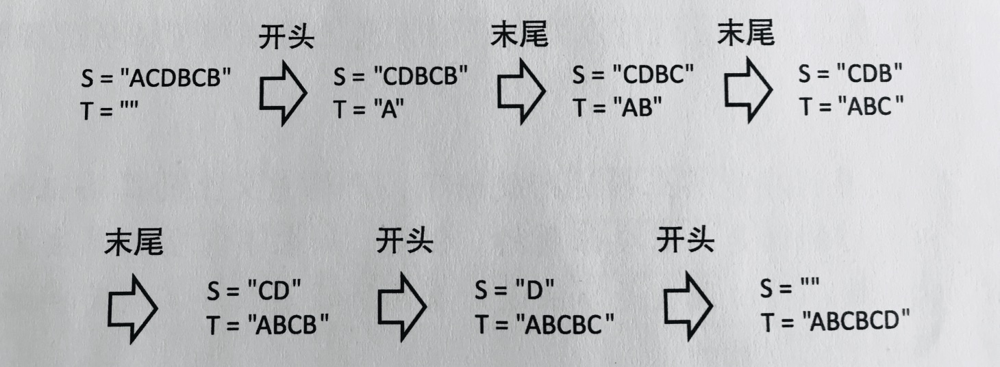

# 基础算法——贪心

January 15, 2021 @KeYuan Liu 

本文如无特殊说明均为伪代码

（~~notion不支持markdown语法就很😣~~）

# 0. QwQ

贪心——贪吃，贪睡，贪玩？（此处应有表情包）😂其实当我第一次听到这个名词的时候，我就在想是那个小机灵鬼发明了这个算法。（小孩子才做选择，我全都要！）当然，今天介绍的这个算法确实有那点味。

其实贪心算法就是按照某种规则，不断的选取当前状态下最优策略以达到整体算法的最优解。先来个生活问题热热身。

### eg1：硬币问题

> 有1，5，10，100，500元的硬币各n个。现在要用这些硬币支付A元。求最少使用几个硬币？
> 

凭大家的直觉，肯定是尽量的选择面额最大的硬币，因为这样用的数量一定是最少的。然而答案就是这样子的——尽量选择面额最大的硬币。贪心是一种比较高效的算法。他不像上一篇文章所讲的dfs和bfs。贪心过程是一个步步找最优解的过程。相比他俩找出所有状态然后选择自己要那个状态的方案。贪心简直是完美的存在。只有一个状态——最优的状态。

---

现在让我们考虑下面这个问题（其实也很经典的）

### eg2：区间问题

> 有n个工作，每个工作都从Si开始，在Ti结束。对于每一个工作，你都可以选择参与与否。如果选择了参与，那么自始至终都必须全程参与，而且参与的时间不能重叠（一个时间段内只能干一件事情嘛）。现在勤奋的你想干更多的工作，那么应该如何分配呢？
> 

那我们就来思考了，如何选择才能使干的活最多。不难想到，大家的方案也就以下几种：

- 在可选工作中选择开始时间最早的
- 在可选工作中选择结束时间最早的
- 在可选工作中选择耗时最短的
- 在可选工作中选择与最少可选工作有重叠的工作

但是只有第二个是正确的，下面将举出一些反例。

- 第一个的反例
  
    
    
- 第二个的正确性

- 第三个的反例

- 第四个的反例

所以说，选择最早结束的是最优选择。这个就是我们贪心的准则。

---

然后我们在来看一下字典序最小问题

### eg3:字典序最小问题

> 给定一个长度为N的字符串S，要构建一个长度为N的字符串T。起初，T是一个空串，随后反复进行下列任意操作。
> 
- 从S的头部删除一个字符，加到T的尾部。
- 从S的尾部删除一个字符，加到T的尾部。

> 目标是构建的字符串T的字典序最小。
> 

举个🌰：

那不难想出，取S的头和尾进行比较，较小的那个放到T的后面，对吧，对吗？不对吧，不全对吧。

如果首尾相同怎么办？这个时候就要用S和S的翻串进行比较。如果S小就用头，如果S大就用尾。如果这个时候还相等怎么办😱？？？ 那就随便选咯😏。

---

最后来个简单题练练手。其实贪心的思想有很多，并不全是套路。

### eg：

> 直线上有N个点，点i的位置是Xi，从这N个点中选取若干个，给他们加上标记。对于每个点，其距离为R内的区域里必须有一个带标记的点。（自己本身带标记可以认为与其距离为0的位置上有一个带标记的点。）在满足这个条件下，希望为尽可能少的点添加标记，请问至少要有多少点被加上标记呢？
> 

～～～～～～～～～～～～～～～清屏大法好～～～～～～～～～～～～～～～～～～～～～

其实这道题还是蛮简单的，考虑距左端点≤R的最靠右的点，以这个点为起点向右覆盖，每次取向右距离≤R的最靠右的点就好了。

好了，以上就是简单的贪心算法。下一次将在贪心的基础上继续拓展到其他算法。