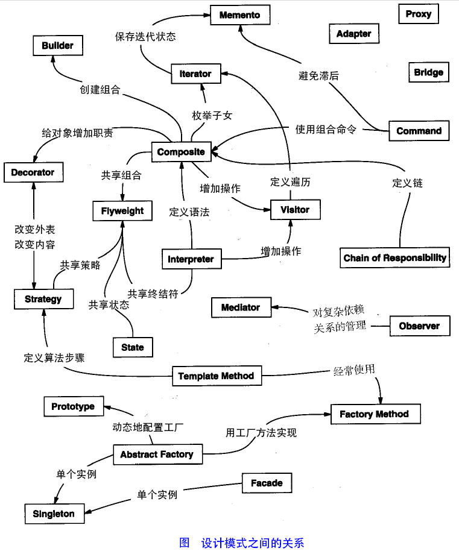
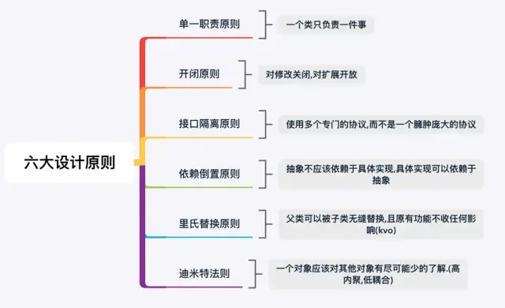

# 如何提高代码设计能力

[https://www.jianshu.com/p/6c718bd0ca8e](https://www.jianshu.com/p/6c718bd0ca8e)

文章转自简书，未经授权，仅为方便内部成员阅读，禁止向外传播。

# 一、面向对象的六大原则

**01**

**开放封闭原则**

       一个软件实体应当对扩展开放，对修改关闭。即软件实体应尽量在不修改原有代码的情况下进行扩展。

**开闭原则即对拓展开放，对修改关闭。**要想在**功能新增**的时候**不修改原先的代码**，即程序中使用的是**抽象类或者接口**，我们**新增的子类或者实现**，这样才能保障我们拓展功能的时候不用修改原先的代码，所以说**抽象化**是**开闭原则**的关键。

**02**

**里氏替换原则**

       所有引用**基类（父类）**的地方必须能**透明地**使用其**子类的对象**。
    
       **基类存在的地方必定能被子类替换，且功能不会发生影响。**里氏替换原则是“开-闭原则的补充”。
    
       里氏替换通俗来讲就是**子类可以拓展父类但是不能改变父类已确定的行为**，包含以下四个含义：

- 子类可以实现父类的**[抽象方法](%E5%A6%82%E4%BD%95%E6%8F%90%E9%AB%98%E4%BB%A3%E7%A0%81%E8%AE%BE%E8%AE%A1%E8%83%BD%E5%8A%9B%20ae21f1203de949dfb82a0e42221e29e1/%EF%BC%88%E6%8A%BD%E8%B1%A1%E7%B1%BB%E5%B0%B1%E6%98%AF%E4%B8%8D%E8%83%BD%E4%BD%BF%E7%94%A8new%E6%96%B9%E6%B3%95%E8%BF%9B%E8%A1%8C%E5%AE%9E%E4%BE%8B%E5%8C%96%E7%9A%84%E7%B1%BB%EF%BC%8C%E5%8D%B3%E6%B2%A1%E6%9C%89%E5%85%B7%E4%BD%93%E5%AE%9E%E4%BE%8B%E5%AF%B9%E8%B1%A1%E7%9A%84%E7%B1%BB%E3%80%82%E6%8A%BD%E8%B1%A1%E7%B1%BB%E6%9C%89%E7%82%B9%E7%B1%BB%E4%BC%BC%E2%80%9C%E6%A8%A1%E6%9D%BFbai%E2%80%9D%E7%9A%84%20cf28633af83b465e87e966bfdc8b5374.md)**，但是不能覆盖父类的**非抽象方法**。
- **子类中可以增加自己特有的方法。**
- **当子类重载父类方法时，形参的范围要比父类的形参范围大，这样别的类调用这个方法时会优先匹配父类的实现而不是子类的实现。**
- 当子类实现父类的**抽象方法**时，方法的返回值要比父类更严格，也可以说成更具体。

**03**

**依赖倒转原则**

       **抽象不应该依赖于细节，细节应当依赖于抽象。换言之，要针对接口编程，而不是针对实现编程。**
    
       依赖倒转原则要求我们**在程序代码中传递参数时或在关联关系中，尽量引用层次高的抽象层类**，即使用**接口和抽象类**进行**变量类型声明**、**参数类型声明**、**方法返回类型声明**，以及**数据类型的转换**等，而不要用具体类来做这些事情。
    
       在实现依赖倒转原则时，我们需要**针对抽象层编程**，而将**具体类的对象**通过**依赖注入(Dependency Injection, DI)**的方式**注入到其他对象**中，**依赖注入是指当一个对象要与其他对象发生[依赖关系](依赖（Dependency）关系是一种使用关系，它是对象之间耦合度最弱的一种关联方式，是临时性的关联.md)时，通过抽象来注入所依赖的对象。**
    
       常用的注入方式有三种，分别是：**构造注入，设值注入（Setter注入）和接口注入。**
    
       **构造注入**是指通过**构造函数**来**传入具体类的对象**，**设值注入**是指**通过Setter方法**来**传入具体类的对象**，而**接口注入**是指通过**在接口中声明的业务方法**来**传入具体类的对象**。这些方法在**定义时使用的是抽象类型**，在**运行时再传入具体类型的对象**，**由子类对象来覆盖父类对象**。
    
       **开闭原则是目标，里氏代换原则是基础，依赖倒转原则是手段。** 

**04**

**单一职能原则**

> 一个类只负责一个功能领域中的相应职责，或者可以定义为：就一个类而言，应该只有一个引起它变化的原因。
> 

       **类的功能尽量单一，这样才能提高复用率。**单一职能原则是**[软件高内聚低耦合](高内聚低耦合，是软件工程中的概念，是判断软件设计好坏的标准，主要用于程序的面向对象的设计，主要看类的.md)**的指导方针。
    
       **使用多个专门的接口，而不使用单一的总接口**，即客户端不应该依赖那些它不需要的接口。

每一接口都应该承担一种相对独立的角色，该干的事情都干，不该干的事情都不干。

**05**

**迪米特原则**

> 一个软件实体应当尽可能少地与其他实体发生相互作用。类与类之间的[耦合度](%E5%A6%82%E4%BD%95%E6%8F%90%E9%AB%98%E4%BB%A3%E7%A0%81%E8%AE%BE%E8%AE%A1%E8%83%BD%E5%8A%9B%20ae21f1203de949dfb82a0e42221e29e1/%E6%A0%B9%E6%8D%AE%E7%B1%BB%E4%B8%8E%E7%B1%BB%E4%B9%8B%E9%97%B4%E7%9A%84%E8%80%A6%E5%90%88%E5%BA%A6%E4%BB%8E%E5%BC%B1%E5%88%B0%E5%BC%BA%E6%8E%92%E5%88%97%EF%BC%8CUML%20%E4%B8%AD%E7%9A%84%E7%B1%BB%E5%9B%BE%E6%9C%89%E4%BB%A5%E4%B8%8B%E5%87%A0%E7%A7%8D%E5%85%B3%E7%B3%BB%EF%BC%9A%E4%BE%9D%E8%B5%96%E5%85%B3%E7%B3%BB%E3%80%81%E5%85%B3%E8%81%94%E5%85%B3%E7%B3%BB%E3%80%81%E8%81%9A%E5%90%88%E5%85%B3%E7%B3%BB%E3%80%81%E7%BB%84%208c8f942c0651483095cb58d1ceda7240.md)应尽量的低，这样如果类发生变化，影响才会最小。
> 

不要和陌生人说话，只和你的直接朋友通信，直接朋友包含如下：

- 当前对象本身（this）
- 作为参数的对象
- 成员变量
- 集合成员变量中的元素
- 创建的对象

**可以通过使用第三者类来降低两个类的耦合度。**

**06**

**合成复用原则**

> 尽量使用对象组合，而不是继承来达到复用的目的。
> 

通过**继承**来实现**复用**的问题是它会**破坏封装性**，子类能够看到基类的实现细节，**自身类通过继承而来的基类方法是静态的（因为继承的类是确定的）**，**而通过调用成员变量去执行成员变量的方法是动态的**，因为成员变量可以是**抽象化**的，而**实现类**可以有很多种，每一种实现类的功能又不相同，但是他们可以被当作同一类型而被引入。

# 二**、设计模式的分类**

总体来说设计模式分为三大类：

创建型模式，共五种：工厂方法模式、抽象工厂模式、单例模式、建造者模式、原型模式。

结构型模式，共七种：适配器模式、装饰器模式、代理模式、外观模式、桥接模式、组合模式、享元模式。

行为型模式，共十一种：策略模式、模板方法模式、观察者模式、迭代子模式、责任链模式、命令模式、备忘录模式、状态模式、访问者模式、中介者模式、解释器模式。

其实还有两类：并发型模式和线程池模式。用一个图片来整体描述一下：

