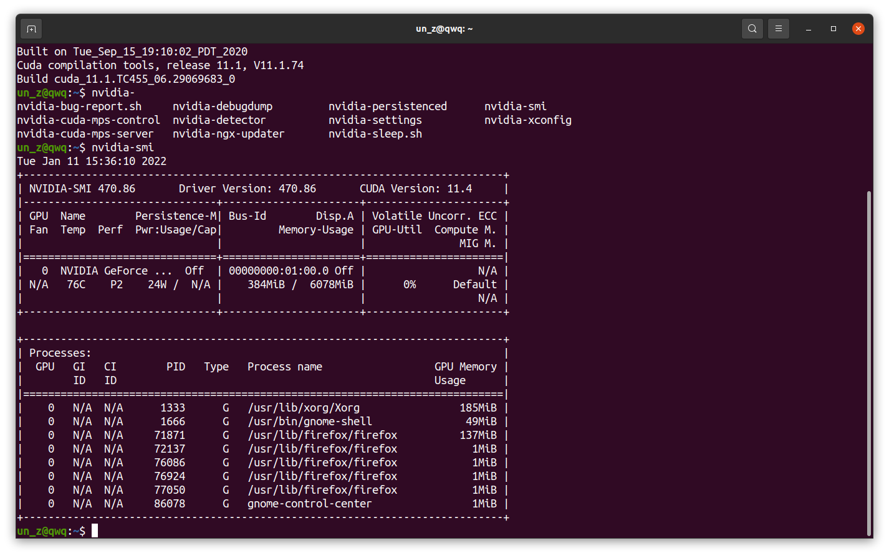
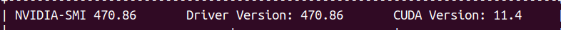
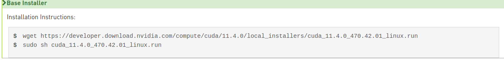

在安装CUDA库之前请确定以下事项已完成

- boot  security已经关闭（从电脑bios上设置）（若不关闭会导致英伟达显卡驱动无法安装）
- 英伟达显卡驱动已安装


1. 查看显卡支持的cuda版本

   ctrl+alt+t打开终端,输入nvidia-smi

   

   

​	这里可以看到当前显卡最大支持的cuda版本为11.4
2. 到英伟达的cuda官网选择对应的版本并下载安装

   https://developer.nvidia.com/cuda-toolkit-archive

   使用deb安装不再叙述，下面讲解使用runfile安装

   （deb安装会自动配置依赖）

   （runfile安装不会配置相关依赖，需要手动添加全局变量）

   

   根据下方给出的命令，打开终端并输入(或则用迅雷下载run文件，拷贝到ubuntu)

3. 环境变量配置

   在~/.bashrc中添加如下

   ```bash
   export PATH=/usr/local/cuda/bin:$PATH
   
  export LD_LIBRARY_PATH=/usr/local/cuda/lib64:$LD_LIBRARY_PATH
   ```
   

   使环境变量生效    
           source  ~/.bashrc
   
   配置 /etc/ld.so.conf.d/cuda.conf 添加如下内容
   
   ```bash
   /usr/local/cuda/lib64
   ```
   
   使库生效
   
   ```bash
   sudo ldconfig
   ```
   
   