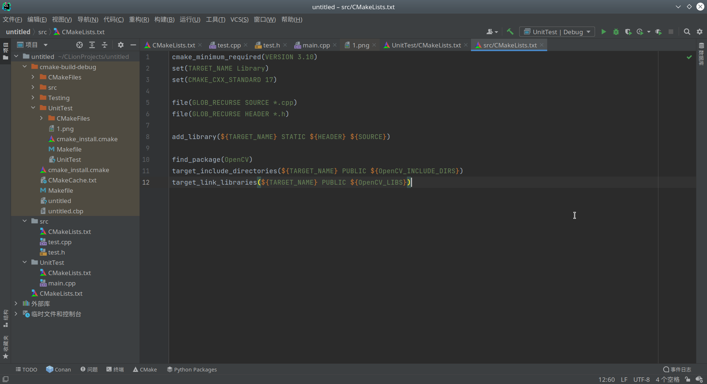
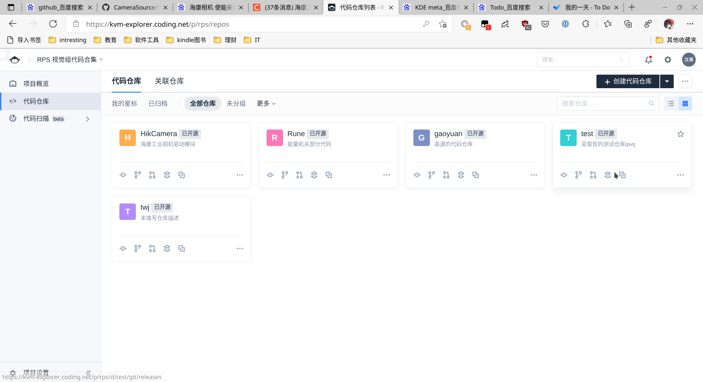
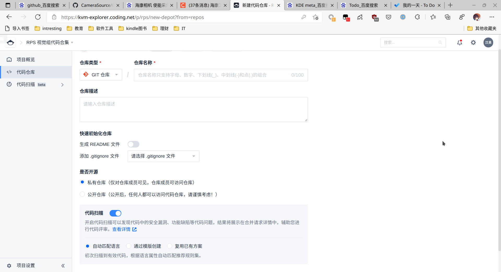
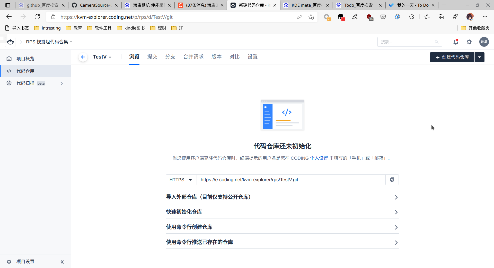

## 在线沙盒式可视化学习
[Learn Git Branching](https://learngitbranching.js.org/?locale=zh_CN)

## 基础知识


## 工具

### GitKraken


## 创建本地git并推送到远程仓库

### 1. 创建本地git管理系统

以Jetbrain系列为例，点击上方菜单VCS->启动版本控制集成（VCS->Enable Version Control Intergration



### 2.  添加git追踪文件

1. 选中所有需要提交的项目
2. 右键点击，在菜单中选择git->Add,将目标文件进行追踪
3. 点击commit进行提交，编写合适的说明文字后提交到本地

### 3. 创建网络代码仓库

新建一个代码仓库，英文命名单词首字母大写



在描述中写明仓库内容和作者，不生成README和gitignore，选择公开仓库（否则别人下载需要你的帐号密码）完成创建。



### 4. 本地推送

点击上方的GIt（原来的VCS）->管理远程添加远程仓库


复制远程仓库链接，添加到本地的远程仓库，点击Push完成推送




## Git 进阶使用技巧


### 1. submodule

对于不需要进行修改直接调用的库我们可以使用submodule进行管理

```bash
git clone <repository> --recursive  //递归的方式克隆整个项目
git submodule add <repository> <path> //添加子模块
git submodule init //初始化子模块
git submodule update //更新子模块
git submodule foreach git pull  //拉取所有子模块
```


## 参考资料

[git submodule 完整用法整理 ](https://www.cnblogs.com/zhoug2020/p/13544721.html)