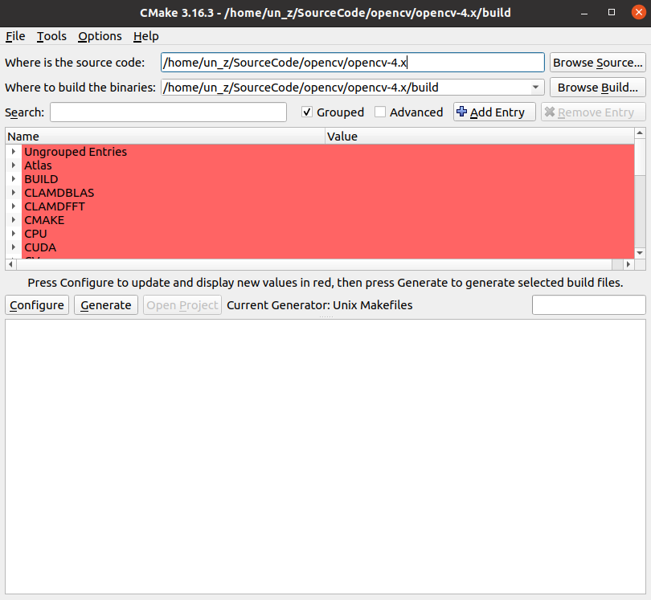
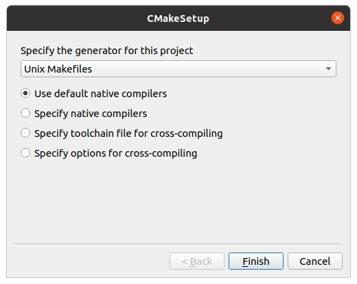
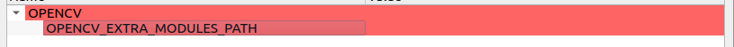
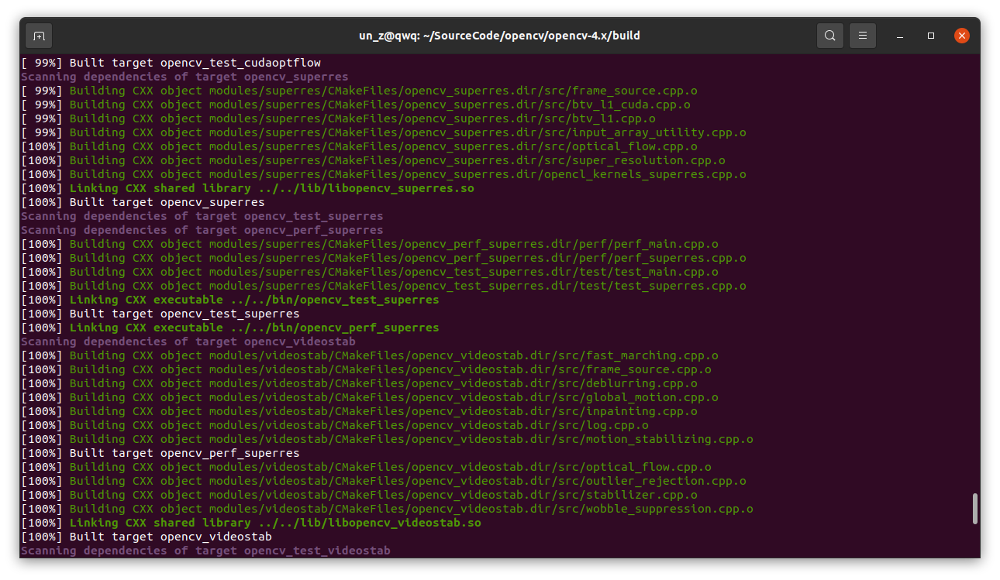

在安装前，请确定以下事项已完成

- cuda安装完毕
- cudnn安装完毕
- qt安装完毕
- tbb安装完毕
- cmake-gui安装完毕

1. 下载opencv源代码

   打开终端，并输入以下命令

   #检查并更新相关的下载程序和解压程序以及编译器

   sudo apt update && sudo apt install -y cmake g++ wget unzip

   

   #下载源代码
   wget -O opencv.zip https://github.com/opencv/opencv/archive/4.x.zip（核心）
   wget -O opencv_contrib.zip https://github.com/opencv/opencv_contrib/archive/4.x.zip（扩展）

   

   #解压下载的源代码
   unzip opencv.zip
   unzip opencv_contrib.zip

   

2. 运行cmake-gui进行make脚本的构建

   

   选择解压的opencv文件

​		选择生成位置

点击Configure，选择Unix Makefiles并运行

在search中搜索以下选项并设置

- WITH_QT

- OPENCV_DNN_CUDA

- WITH_CUDA

- WITH_TBB

- OPENCV_EXTRA_MODULES_PATH

  选择解压出来的opencv_contrib-4.x/modules路径

点击Configure确定配置并构建

4. 使用make根据cmake给出的脚本进行编译

   使用终端打开构建出来的文件夹，输入make即可进行（速度较慢）

   可以输入make -jx进行多核工作，x为工作的核数

   例：make -j4为使用4核进行工作

   （核数的增多可能会导致链接出现问题，继续输入make -jx可以继续之前的工作）

   （若无论如何都会出现问题建议单核）

   

5. 将编译完成的opencv文件安装

   make完成后，在继续在终端输入make install即可