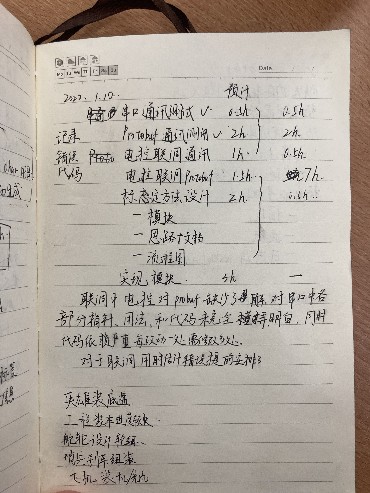

## 时间记账

### 准备

最好准备一个纸质笔记本

### 开始

列举当日计划执行的任务并进行子任务的划分标明对应预期完成的时间，如下图所示

### 结束

一天结束后，将各任务完成时间进行记录和汇总，简单反思和总结下预计和实际出现较大差异的原因以及自己的不足之处。在后期将问题进行解决和针对不足进行补弱。

### 解释

一方面养成一个记录的习惯，逐渐增强时间观念和对于自身能力的把控。在正式参与赛季计划做准备，提高协调和管理时间的能力。针对自身状态及时进行调整和纠正。

## 文档整理

对于日常碰见的问题及对应的解决方法、学习的知识进行整理，汇总到百科。同时更加注意对于知识的整理和输出，不要单纯的复制粘贴。

