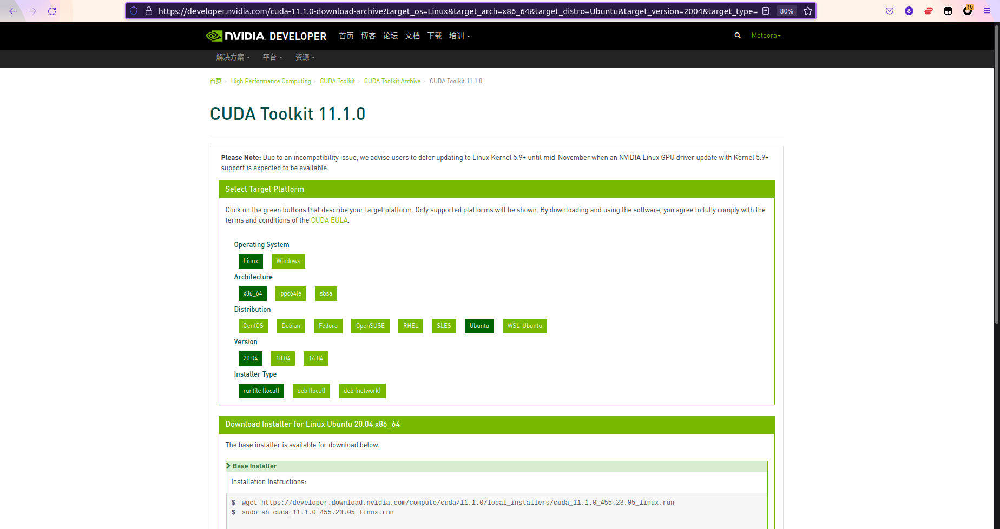
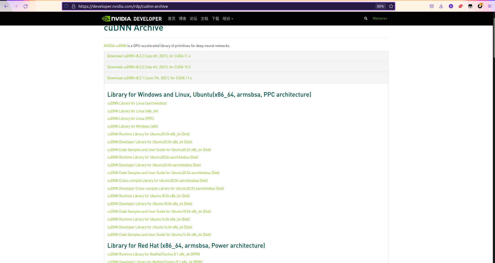
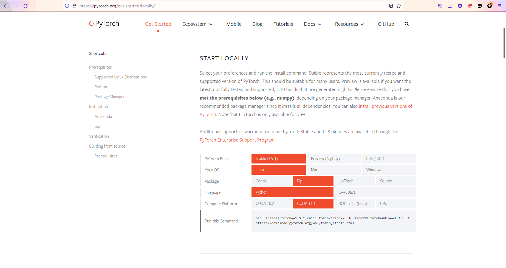

> 机械、电控、视觉三位一体，运营护航

## 一、安装

### 1.  安装环境

- 系统：Ubuntu（20.04LTS）

- 硬件：cpu : i5-11400F

  ​		    gpu：RTX3060

- CUDA 版本：11. 1

- CUDNN 版本 ：8.2.1

### 2. YOLOX安装步骤

#### 准备阶段

##### 概括

该阶段主要是配置CUDA和CUDNN

##### 详情

1. CUDA 安装

   地址： https://developer.nvidia.com/cuda-11.1.0-download-archive

   

   按照官方教程来就行了

   安装deb 之后，记得添加环境变量

   添加环境变量的教程https://blog.csdn.net/w5688414/article/details/103302319

   安装好之后，可以通过 nvcc -V 查询

2.  CUDNN 安装

   地址：https://developer.nvidia.com/rdp/cudnn-archive

   选择与 CUDA 版本相对应的 CUDNN ，进行下载。安装时注意安装顺序，先安装runtime，再安装developer。sample包随意。

##### 注意

 	1. 若是 CUDA 版本安装错误，想要删除 CUDA ，可以进入  /usr/local/cuda-XXX/bin（你错误安装的cuda版本），运行里面的 cuda-uninstaller（命令行运行，及记得加权限）
 	2. 若是 CUDNN 版本安装错误，想要删除错误版本的CUDNN，在命令行输入 apt search cudnn ，找到的相应的 CUDNN 版本进行删除即可。删除时，注意删除顺序，先删除没有 dev 后缀的，再删除有 dev 后缀的


安装YOLOX

官方地址：https://github.com/Megvii-BaseDetection/YOLOX

安装的方法就是官方的 README.md 里面的 Quick Start 里面的 Installation里面的步骤

#### 安装YOLOX

##### 安装YOLOX

```
git clone git@github.com:Megvii-BaseDetection/YOLOX.git
cd YOLOX
pip3 install -U pip && pip3 install -r requirements.txt
pip3 install -v -e .  # or  python3 setup.py develop
```

##### 安装pycocotools

```
pip3 install cython; 

pip3 install 'git+https://github.com/cocodataset/cocoapi.git#subdirectory=PythonAPI'
```


#### 运行demo

##### 下载模型

| Model                                                        | size | mAPval 0.5:0.95 | mAPtest 0.5:0.95 | Speed V100 (ms) | Params (M) | FLOPs (G) | weights                                                      |
| ------------------------------------------------------------ | ---- | --------------- | ---------------- | --------------- | ---------- | --------- | ------------------------------------------------------------ |
| [YOLOX-s](https://github.com/Megvii-BaseDetection/YOLOX/blob/main/exps/default/yolox_s.py) | 640  | 40.5            | 40.5             | 9.8             | 9.0        | 26.8      | [github](https://github.com/Megvii-BaseDetection/YOLOX/releases/download/0.1.1rc0/yolox_s.pth) |
| [YOLOX-m](https://github.com/Megvii-BaseDetection/YOLOX/blob/main/exps/default/yolox_m.py) | 640  | 46.9            | 47.2             | 12.3            | 25.3       | 73.8      | [github](https://github.com/Megvii-BaseDetection/YOLOX/releases/download/0.1.1rc0/yolox_m.pth) |
| [YOLOX-l](https://github.com/Megvii-BaseDetection/YOLOX/blob/main/exps/default/yolox_l.py) | 640  | 49.7            | 50.1             | 14.5            | 54.2       | 155.6     | [github](https://github.com/Megvii-BaseDetection/YOLOX/releases/download/0.1.1rc0/yolox_l.pth) |
| [YOLOX-x](https://github.com/Megvii-BaseDetection/YOLOX/blob/main/exps/default/yolox_x.py) | 640  | 51.1            | **51.5**         | 17.3            | 99.1       | 281.9     | [github](https://github.com/Megvii-BaseDetection/YOLOX/releases/download/0.1.1rc0/yolox_x.pth) |
| [YOLOX-Darknet53](https://github.com/Megvii-BaseDetection/YOLOX/blob/main/exps/default/yolov3.py) | 640  | 47.7            | 48.0             | 11.1            | 63.7       | 185.3     | [github](https://github.com/Megvii-BaseDetection/YOLOX/releases/download/0.1.1rc0/yolox_darknet.pth) |

按照自己所需要的模型，点击weights里面的github链接下载

##### 运行demo

```
python3 tools/demo.py image -n yolox-s -c /path/to/your/yolox_s.pth --path assets/dog.jpg --conf 0.25 --nms 0.45 --tsize 640 --save_result --device [cpu/gpu]
```

- python3 是程序运行的类别
- tools/demo.py 是运行的 Python 程序
- image 是要处理的文件的类型，除了图片，还有视频类型可以选择
- -n yolox-s 是运行的模型是yolox-s。这个模型可以自己选择改变
- -c /path/to/your/yolox_s.pth 是运行的模型文件的地址，该地址是在 YOLOX 目录下的相对地址
- --path assets/dog.jpg 是要处理的文件的地址
- --save_result 是选择要将处理的文件输出
- --device 是选择处理的设备。选择 cpu ，就是 --device cpu，gpu与之类似。

### 3. 可能会遇到的问题

1. CUDA较新，导致 pytorch 的默认下载版本与该 CUDA 版本不匹配。

   上官方地址 https://pytorch.org/get-started/locally/

   

   选择你的配置的环境，选择合适的CUDA 版本的支持，再通过命令行执行 Run the Command 里面的代码。就好了。

## 二、运行时可能会遇到的问题

### 1. 训练集中的识别类型和模型中设定的类型不符

问题截图：


问题原因：在训练模型时，模型识别到的训练集中的类型与模型自身设置的类型不匹配，

