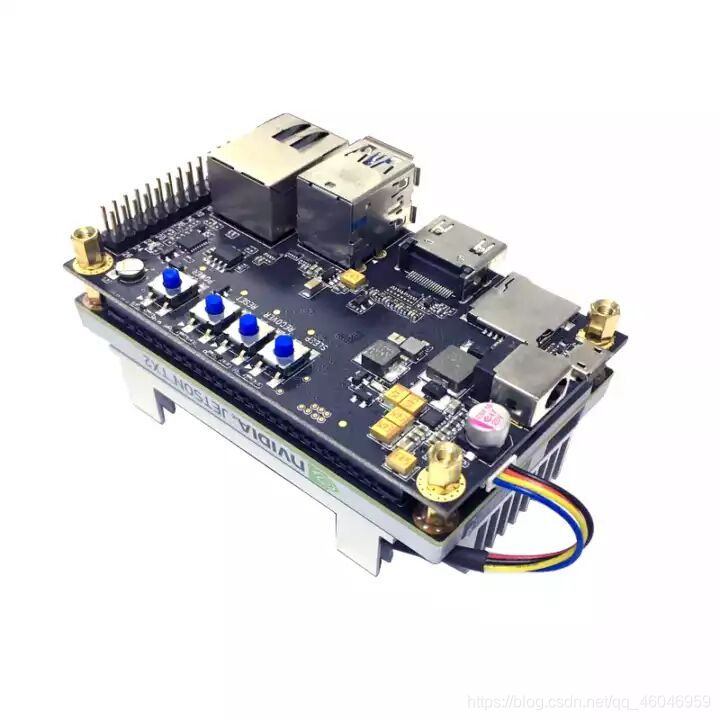
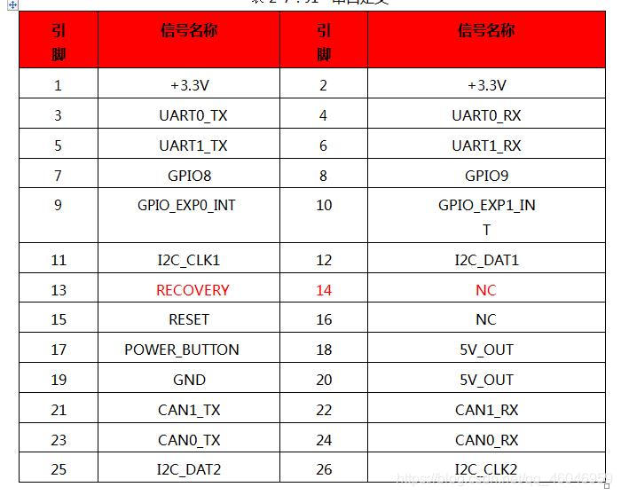
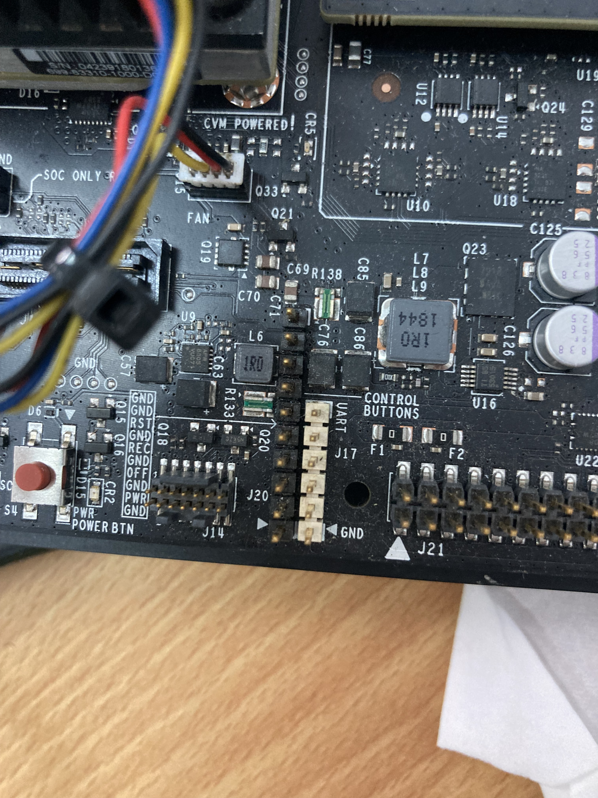
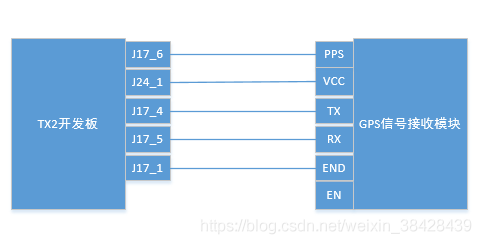

## 串口异常分析

1. 如果串口端口不存在或者程序未以管理员权限启动，则try-catch能够获取“系统找不到指定的文件”文件异常。**错误代码13,错误描述信息Bad file descriptor**
2. 如果串口端口没有和实际的串口连接，则try-catch能够获取“设备没有连接”的异常。
3. 如果在电脑之上连接一个串口线，则用此函数打开对应的端口（如COM4 ）就不会出现以上两个异常。
   1. 如果不在此串口下挂一个设备，则对端口进行读写操作的时候会出现异常，如读串口数据时会在read函数这里卡住。
   2. 但如果在串口下挂一个设备如51单片机学习板则此函数会返回并读出一定的数据回来（虽不一定正确）。
   3. 如果将挂在串口下的设备开启，try-catch会捕获“连接到系统上的设备没有发挥作用”或者是read函数又开始不能返回。


## Boost 串口通讯

### 基本流程

1. 创建IO调度器
2. 利用调度器创建串口对象
3. 打开串口
4. 设置相关串口参数（**一定要在串口开启后操作**）
5. 进行读写操作

### 同步和异步

同步可以认为是阻塞式，调度后等待任务完成后在执行下一项

异步可以认为是多个线路并行处理，调度后继续执行下一项，等子线路完成后回调处理内容

## 字符串和字符数组的转换

char类型占8位1字节，的空间大小，不同编译器对char的实现不同有的默认是signed char 有的是unsigned char 从8位补码的角度理解，两种是对于同样数据的不同解释。即使中间字符串或者字符数组用singned char表示后期依然可以通过unsigined char的指针的到正确的结果。其原因在于两者所占内存空间的大小是一样的。

### unsigned char转string

```C++
unsigned char bytes[str.size()+3];
std::string  result(reinterpret_cast<const char *>(bytes));
```

### string 互转 vector

```c++
//1.string转vector

std::string Str = "hello world!";

std::vector<uint8_t> Vec;

Vec.assign(Str.begin(), Str.end());

//2.vector转string

std::string Str;

std::vector<uint8_t> Vec(6, 7);

Str.assign(Vec.begin(), Vec.end());


```

### asio::buffer 转换

```c++
//1. vector 转boost::asio::buffer
std::vector<unsigned char> bytes;
result = boost::asio::buffer(bytes.data(), 512);

//2. char数组 转boost::asio::buffer
unsigned char bytes[1024];
buffer = boost::asio::buffer(bytes)
```

### asio::streambuf 转string

asio::buffer 和 asio::streambuf 区别 前者是对不申请内存，是对现有内存进行封装。后者动态申请内存，可以认为是一个无线缓冲区。

```c++
++asio::streambuf b;
asio::streambuf::mutable_buffers_type bufs = b.prepare(512);    // reserve 512 bytes in output sequence
size_t n = sock.receive(bufs);
b.commit(n);    // received data is "committed" from output sequence to input sequence

// 第一种将b转为istream 然后转为s
std::istream is(&b);
std::string s;
is >> s;

// 第二种将b转为const char *
const char *data_ptr = boost::asio::buffer_cast< const char* >(m_buffer->data());
std::string line(data_ptr ,data_ptr+n )

// 第三种调用buffers_begin
asio::streambuf::const_buffers_type bufs = sb.data();
std::string line(asio::buffers_begin(bufs), asio::buffers_begin(bufs) + n); 

```


## 串口调试流程

1. 双串口ttl自我通讯测试
2. 电控结合板进行串口助手（Linux：cutecom）收发测试
3. 电控结合板进行PC和电脑的串口数据收发测试
4. 电控结合板进行PC和电脑的probuf封装帧收发和解析测试
5. 采用闲置TX2进行串口收发测试时

## 串口接线

### Tx2 小载板接口图





### Tx2 大载板接口图





J17 系列从上到下依次为6到1。 J17_1是接地GND


## 串口调试问题汇总

- 连续发送无法分辨帧和帧的间隔——短暂sleep下

- 接收方无法明确接收的数据是那一帧发送的——单纯的字节拼凑至缓冲区满'\0'可认为是终止符
  - 确定电控发送数据是'\0'导致以及'\n''\r’是否有效
  - 

## Todo

1. 同步读取，出现异常一直处于阻塞状态，添加计时器计时舍弃

## 参考资料

[[0921 实践]C++ boost::asio::serial_port 串口通信类 使用 封装 笔记](https://www.xuebuyuan.com/1363689.html)

[如何在Jetson TX2上使用串口](https://cloud.tencent.com/developer/article/1151499)

[Jetson TX2装载板 底板TW - TX - 007串口通讯(引脚定义图)](https://blog.csdn.net/qq_46046959/article/details/111560460)